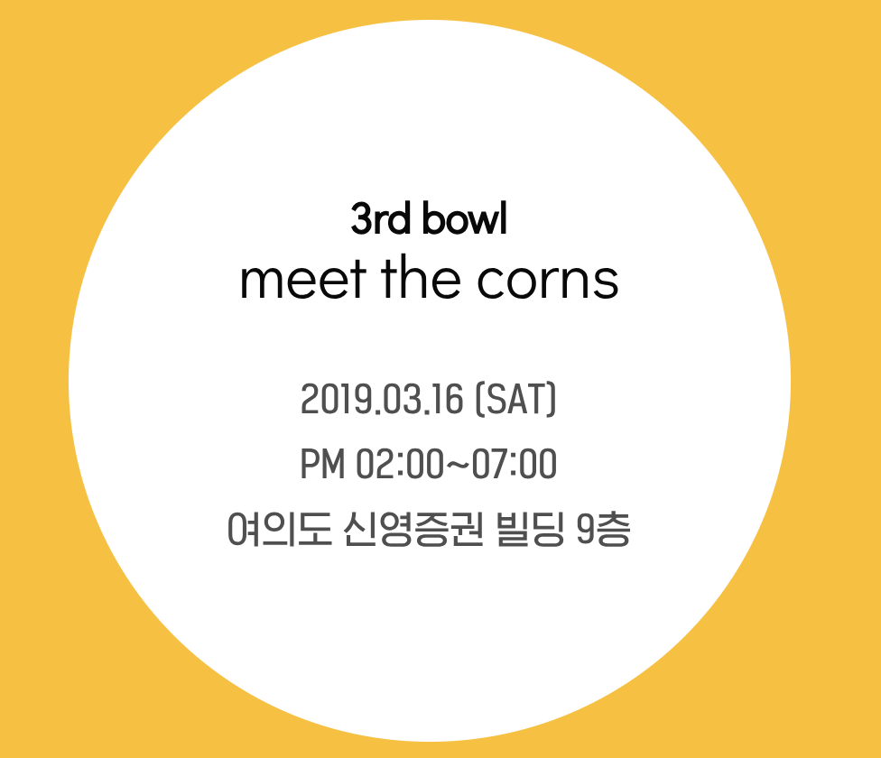
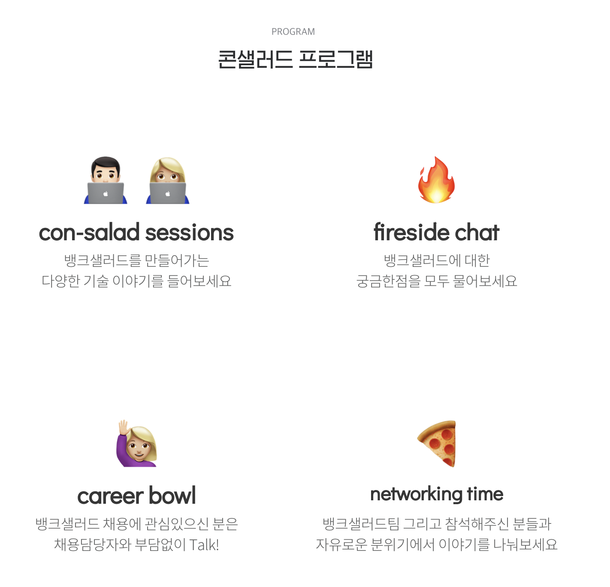
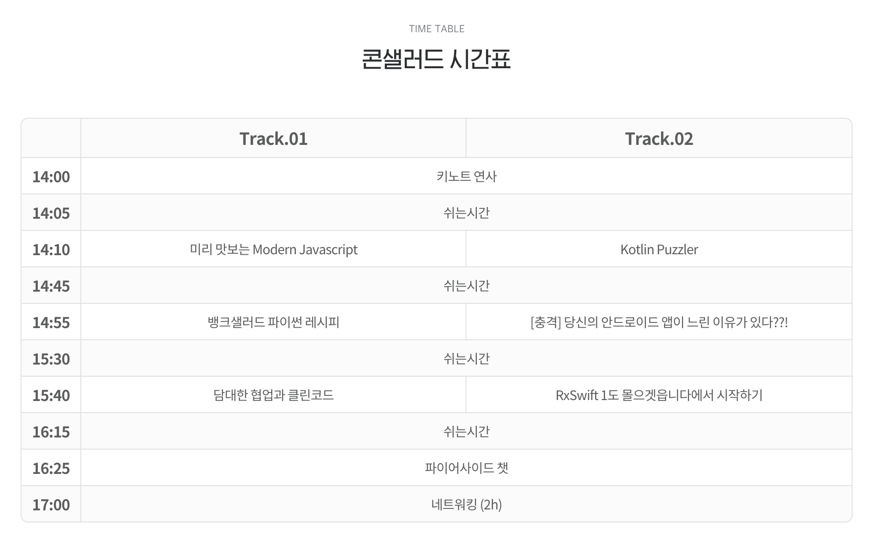

# [뱅크샐러드](https://banksalad.com/) Con-Salad 03 - 2019-03-16

 

## 키노트 연사

1. 콘샐러드를 시작한 이유

   - 컨퍼런스를 시작한 모티베이션은 외부 인력들과의 심도 있는 대화를 하기 위해 시작

     (첫 컨퍼런스 때는 뱅크샐러드가 유명하지 않아 잘 안 됐었다는 슬픈 전설이...)

2. 뱅크샐러드 소개
   * 여의도로 이사 온 지 2달 됐음
   * ~~ 뱅크샐러드 소개해 주심

3. 콘샐러드 소개
   * 콘샐러드 컨퍼런스는 2달에 1번씩 진행하는 행사
   * 다음 콘샐러드는 5월에 진행 예정
   * 이번 컨퍼런스는 웹 트랙과 모바일 트랙 나눠서 진행

## 미리 맛보는 Modern Javascript / Front-end Engineer 이동근

##### 부제: Javascript의 TC39가 뭔지, TC39가 Proposals 하는 방식, 지금 미리 알아두면 좋은 TC39 Proposals 4가지.

금융기획서, 연금기능 담당

1. ECMAScript ? TC39? Proposals?

   - Javascript는 최초 동적 움직임을 위해 만들어졌음

   - 시간이 지남에 따라 브라우저별로 자체적인 스크립트가 만들어짐

   - 브라우저별로 따로 개발해야 하니 너무 화나서 Netscape가 표준을 만들자고 함

   - ECMA International에서 ECMAScript가 나옴

   - 그 표준을 정하는 조직이 TC39

   - TC39는 대기업, 중소기업, 학교 등 여러 곳에 소속된 사람들이 참여 중

   - ECMAScript 표준이 되기 전에 모든 Proposal은 Proposals에 등재됨

   - 등재된 Proposals는 4단계에 거쳐 심사를 받음

     (TC39의 모든 동의가 있어야 통과)

   - 이렇게 모든 단계를 거치면 ECMAScript 표준이 됨

2.  TC39 Proposals를 보는 이유

   - 사내에서 개발할 내용이 있었는데 Optional Chaining 기능이 필요했음

   - Optional Chaining을 검색해보니 TC39 Proposals에 올라와있음

   - 그 기능을 사용해서 쉽게 풀었다는 아름다운 이야기

3. 함께 맛보는 Proposals

   - Classfields, #private, Dynamic import, Array Flat, ...등 많은 내용 설명해주심

4. Q/A

   - 뱅크샐러드의 장점은 뭔가요?

     자신의 주장을 확실하게 할 수 있다

   - Proposals에 있는 기능들을 사용하게 된다면 나중에 표준이 되지 않았을 때 레거시 코드가 될 수 있는데 그런 부분에 대해서 어떻게 관리를 하고 있나요?

     일반적으로 표준이 될 것 같은 기능들을 사용하고, 내부적으로 TODO 리스트를 가지고 관찰하고 있음

     상황에 따라 롤백을 진행하면 될 것 같음

   - 뱅크샐러드의 장점이 자신의 주장을 확실하게 할 수 있다는 것인데 그러면 사공이 많아져서 산으로 가지 않나요?

     주장은 할 수 있지만 그대로 진행하는 것은 아님

     회의는 기획자, 개발자 모두 참여하여 자신의 주장을 낼 순 있지만, 결정권자(PM)가 조율하며 진행됨

   - 연금 기능 개발 기간은 얼마나 걸렸나요?

     기획단계부터 진행하진 않았지만 한 달 정도 걸린 것 같음

     MVP로 개발 후 추후 살을 붙여나갈 예정

   

## 뱅크샐러드 파이썬맛 레시피 / Server Engineer 정겨울

##### 부제: 파이썬 애플리케이션의 구조, 코드를 더 잘 작성하기 위해서 필요한 것들, 테스팅과 아키텍쳐, GitHub 설정 등. 

1. 파이썬을 사용하게 된 이유 (재료)
   * 뱅크샐러드에선 백엔드 팀과 데이터 팀 모두 파이썬을 이용 중
   * 빠른 개선과 배포를 중요하게 생각
   * 린하게 움직여 제품에 반영하고 사용자들의 피드백을 통한 개선을 반복하는 것이 목표
   * 위와 같은 상황을 고려하다 보니 MSA + 파이썬으로 선택
   * 네트워크 IO가 많은 MSA 환경에서 적극적인 비동기를 활용
   * 이벤트 루프 비동기 방식 사용 중
   * 이유는 가장 일반적이고 익숙한 패턴이며 언어 레벨에서 나이스한 문법을 제공 함
2. 어떻게 사용하고 있는가 (조리법)
   * Sanic 비동기 프레임워크 사용
     * aiohttp와 flask를 사용 안 한 이유?
       * 더 빠름
       * 간결한 문법
       * 확장된 기능 제공
       * 관리가 더 잘되고 있음
   * 앱 팩토리 패턴
     * 라이브러리 차원에서 데코레이터(@)로 처리 함
   * 클린 아키텍처를 도입
     * 도입 이유
       * 도메인을 중심으로 개발 가능
       * 공통된 구조를 통해 유지 보수성 증가
   * 배포 및 관리
     * Docker Container 사용
     * 멀티 스테이지 빌드
   * 테스트
     * Pytest 사용
       * 간결하고 깔끔한 테스트 코드 사용 가능
       * Unittest 코드를 Pytest로 사용 가능
     * DB 테스트 방법
       * Mocking Repository 사용
     * 외부 API 테스트 방법
       * Mocking Session 사용
       * 외부 API에서 에러가 나는 문제는 배제한다!
     * Git Hooks를 이용한 테스트 자동화 이용 중
       * CI까지 확인하기는 너무 주기가 길어지기 때문에 Git Hooks를 사용
   * 

3. 함께하는 개발 (식사)

   * public하게 스타일 가이드를 명시 중
   * 전원 합의를 거친 코드 컨벤션에 따라 개발
   * Docker 등 앞에서 말한 것들을 전부 템플릿으로 관리 중
   * Cookiecutter를 사용하여 정해진 템플릿으로 개발을 시작
   * 협업의 장인 Github을 잘쓰는 것이 가장 중요
     * Issue Template 사용
       * 맥락 파악 및 레거시 의사소통 비용 감소
     * PR Template 사용
       * 라벨을 구분하여 사용함
     * 건강한 코드리뷰 문화를 위해 규칙을 정해 관리
       * 코드리뷰는 500줄 이내로 (500줄 이내가 좋은 건 과학적으로 증명된 것임! 아무튼 된 것임!)
       * PR 올리는 사람이 알아볼 수 있게 배려하자
     * 필요한 경우 컨텍스트 공유하는 자리를 마련하길 권장함
     * 팀과 팀을 넘어 서로서로 코드 리뷰를 요청함

4. Q/A

   * 배포는 어떻게 하고 있나요? 무중단 배포를 사용하고 있나요?

     개발단계의 경우 Git hooks로 검사, Docker Hub에 넣으면 Deploy Bot이 배포

     상용단계에선 반 매뉴얼로 담당자 컨펌 후 배포 진행

     쿠버네티스를 사용하기 때문에 무중단 배포 중임

   * 개발자들끼리 Git으로 이슈를 관리하면 QA 팀이나 기획팀 등 다른 팀에선 어떻게 하나요?

     다른 팀은 Jira를 사용 중이며, Jira로도 이슈 관리 중

     중복된다고 생각할 수 있지만 그래도 장점이 많은 것 같음

   * DB는 어떤 것을 사용하고 있나요?

     NoSQL로는 MongoDB를 사용하고 있으며, RDB로는 MySQL을 사용 중

      물론 ORM도 사용 중 

   * Python 레거시 코드를 3.7로 마이그레이션 할 때 발생하는 문제는 어떻게 해결하셨나요?

     처음 개발 때 3.6으로 시작해서 마이그레이션 이슈는 없었음

   * 관리하는 데이터가 금융 데이터이기 때문에 망분리 등 규제를 많이 가지고 있을 것 같은데 어떻게 처리하고 있는지? 그리고 이러한 민감 데이터를 관리하면서 겪고 있는 어려운 점이 있다면 말해주세요!

     그러한 자세한 부분은 파이어사이드 챗 시간에 물어보시면 자세한 답변을 받을 수 있습니다..!

뱅크샐러드 어플을 사용하고 있는데 너무너무너무(갓어플) 좋아서 감탄하고 있던 도중 개발자 컨퍼런스를 진행한다는 소식을 듣고 바로 신청해서 들으러 감

웹 트랙으로 참여해서 두 번째 세션까지 듣다가 기대했던 내용과 달라서 도중에 나왔음

느낀 점은 뱅크샐러드는 개발자의 성장을 굉장히 신경쓰는 회사인거 같고, 건물도 좋고 전부 너무 좋아 보임

앞으로 쭉쭉 성장할 것 같다.

