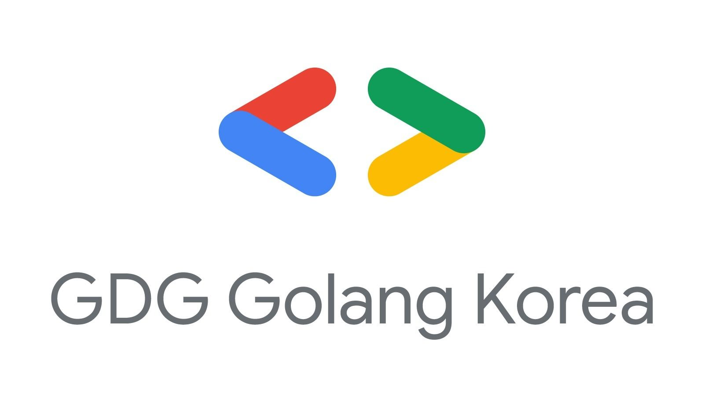
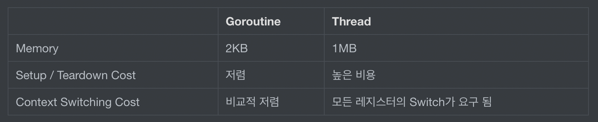

# GDG Golang Korea 1st Meetup

- 주최: Google Developers Group
- 일시: 2019/05/30 20:00 ~ 22:00
- 장소: 서울특별시 강남구 논현로85길 46 갈라 빌딩 메가존(주) 지하 1층 대강연장

## About

1. [Biscuit: An Operating System Written in Go] 박성재
   Biscuit 은 MIT 에서 만든 연구용 운영체제로, Go 언어로 작성되었습니다.
   이 운영체제의 소스코드를 받아서 빌드하고 부팅해 사용하는 법을 알아보고
   그 소스코드를 아주 조금 분석해 봅니다.

2. [고2학생의 gin 프레임워크로 restful api를 더 잘 만들기 위한 라이브러리 개발기] 황선우
   직접 개발한 gin 프레임워크 extension인 gin-restful 라이브러리에 대한
   소개와 구현방법, 사용법에 대해서 발표하려고 합니다.
   gin-restful은 rest api를 개발할 때 gin 라이브러리와 함께 사용하면
   더 쉽게 rest api를 개발할 수 있도록 만든 라이브러리입니다.
   (https://github.com/hwangseonu/gin-restful)

3. [gRPC와 Goroutine 각각은 대체 어떤 원리로 돌아갈까?] 한성민
   우리가 마법으로만 알고 사용하고 있었지만,
   어느날 우연히 그 원리가 미칠듯이 궁금하진 않으셨나요?
   가끔씩 몸에 좋다고 먹는 홍삼 진액이, 비싼돈 주고산 아카시아 꿀이
   대체 어떻게 몸에 좋은 것인지 위키에 검색해보고 싶진 않으셨나요?
   고 언어에는 고루틴(Goroutine)과 gRPC가 있습니다.
   우리가 이 두가지의 테크닉을 사용하건 하지 않건 한번 쯤 좋다고 들어봤을 것입니다.
   대체 이 마법과도 같은 기능이 어떤 원리로 구성되어 있을까요?
   이 세션에서 우리는 다시 초심으로 돌아와
   순수한 마음으로 이 두가지의 테크닉의 심연을 들여다봅시다.
   그리고 다른 언어들은 이런 기능을 어떻게 대체하고 있을지 살펴봅시다.

## Content

### Biscuit: An Operating System Written in Go

1. 발표자 소개
   - 서울대 박사로 OS, Memory 연구 중

2. 운영체제
   - 운영체제 커널들은 C로 만들어졌다.
   - 애초에 C는 Unix를 만들기 위해 만들어진 언어
   - C 이전 운영체제들은 어셈블리로 개발했음
     - 어셈블리로 개발하면 하드웨어에 디펜던트한 문제가 발생
     - 그래서 C 언어가 나오게 됨

   - C로 무언가를 개발하면 매번 나오는 질문 
     - 토발즈가 Git을 만들었을 때 왜 C++로 짜지 않았나? 라는 질문받으심
       - 대답: [C++은 쓰레기다.](###토발즈)

   - 운영체제를 왜 Go로 짜지 않았나? 라는 질문도 받으심
     - 대답
       - 고는 좋은 선택이지만 현재는 너무 실험적이다.
       - 20년쯤 지나서 언어가 성숙해지면 생각해보자.
     - C++의 답변보다 매우 좋은 답변을 받음.
     - 이 질문을 한 것이 10년 전이며, 이제 언어도 성숙해졌으니 고려해볼 타이밍

3. Biscuit이란?
   - POSIX-style kernel
   - 왜 HLL(High Level Language)로 OS를 만들려고 할까?
     - 장점
       - 빠르게 만들 수 있음
       - GC 제공
       - Kernel Bug 방지를 언어레벨에서 제공 받을 수 있음
       - Memory Bugs 
         - Memory Safety Bug가 가장 중요한 문제
         - 2017년 리눅스에서만 40회 이상 발생

     - 단점
       - 언어레벨에서 제공하는 기능이 많기 때문에 성능이 안 좋음
         - OS 커널의 가장 중요한 성능

     - 실제 장단점은 어느 정도 수준일까?
       - 리눅스와 똑같은 구조를 Golang으로 만들어봄
       - 이게 비스킷

4. 다른 HLL이 아닌 Go를 선택한 이유
   - 어셈블리 언어를 섞어쓰기 좋음
     - 실제 C로 만들어진 리눅스도 어셈블리 언어를 사용한다. (피할 수 없음)

   - 동시성 좋음
   - 언어 레벨에서 제공하는 정적분석 기능이 좋음
   - GC 성능이 좋음
   - HLL로 구현해도 근본적인 문제는 없음
   - 하지만 존재하는 문제들
     - Heap Exhaustion
       - heap이 꽉찼을 때 어떻게 해야 할까?
       - Allocator가 wait
         - Deadlock 발생 가능성 있음
       - 실패 에러를 보냄
         - 리눅스도 이런 식으로 처리 중
         - 하지만 고는 언어 자체에 메모리 할당 실패가 없음 (암묵적으로 성공)
       - 해결방법
         - 커널 빌드 시점에 메모리를 정적으로 정해둠
           - 운영체제의 Deadlock 방지

5. 요약
   1. Golang으로 만들었을 때의 장점
      - GC Allocation 쉬움
      - Defer
      - Multi Valued Return
      - Closure
      - Maps
      - Memory Safety
      - 8개 use-after-free/double-free 문제 해결
        - Disappear due to GC
      - 32개의 out-of-bounds 해결
        - panic or disappear due to GC
      - 고를 쓰면 RCU 없이 Lock-free 하게 개발할 수 있음
        - Linux는 RCU 라는 기법으로 메모리를 관리

   2. Golang으로 만들었을 때의 단점
      - 성능
        - 얼마나 차이가 날까?
        - 커널을 많이 쓰는 앱으로 테스트 진행	
        - Debian 9.4 환경에서 진행
        - 테스트 결과 10%도 차이 안남
        - 정확한 테스트를 위해 전용 앱 만듬
          - 앱에서 돌아가는 기능 없이 커널만 테스트 진행
          - 오버헤드 생기긴 함
          - 하지만 성능 차이는 15%

6. 결론
   - 일반적인 워크로드에서는 성능이 10%도 안남
   - 극한적인 워크로드로 테스트해도 최대치 15%
   - 커널의 매우 성능이 중요하면 C
   - 안정성이 매우 중요하다면 Go
     - 즉 15%정도 손해봐도 상관 없으면 Go
   - 진짜 결론: Golang으로 만들어도 괜찮은 커널 같다!

7. 실제 비스킷 커널을 올리는 내용 시연

### Q/A

1.  예전에 토발즈가 리눅스 커널 빌드 릴리즈를 했을 때 성능에 대한 부분에 지적을 받았었고, 
  그 답변으로 개발자들 앞에서 운영체제 만들어본 사람 있냐고 물어본 적이 있다.
  여러 사람들이 손을 들었었고, 그 모습을 보며 지금 그 운영체제를 돌리고 있냐는 질문에 대부분 손을 내렸었다.
  이처럼 O/S라는 것은 만들기는 쉽지만 Production 환경에서 사용하기엔 실용적이지 않다고 생각한다.
  이 내용에 대해 어떻게 생각는가?

> 지금 비스킷은 운영체제용 장난감인 상태이다.
>
> 솔직히 지금 시점에서 새로운 운영체제가 중요한가 싶은 생각을 가지고 있다.
>
> 현재 리눅스 개발에도 참여하는 입장에서 한동안 리눅스를 넘는 운영체제가 나오지도 않고 필요도 없다고 생각한다.
>
> 하지만 나는 실용적인 것을 발표하지 않고 재밌는 것을 발표하는 사람이다.
>
> 현재 실용적인 것을 생각하는 것 보단, 이러한 것도 있구나 하면서 넘어가면 좋을 것 같다.

### 고2학생의 gin 프레임워크로 restful api를 더 잘 만들기 위한 라이브러리 개발기

1. 발표자 소개
   - 이름: 황선우
   - 나이: 만 17세
   - 소프트웨어 마이스터 고등학교 2학년 재학 중
   - Java, Kotlin, Golang, Python 등 언어를 사용

2. 웹 프레임워크들 소개
   - Web MVC Framework
     - Revel
     - Beego
   - Micro Web Framework
     - Gin
     - Echo
     - Iris

3. Gin Framework
   1. Gin Framework를 선택한 이유는 단지 Git Star가 많아서
   2. 장점
      - 쉽다.
      - 다른 언어에 비해 성능이 좋다. 
      - 병렬 프로그래밍이 쉽다.
      - 자유로운 구조를 가지고 있다.

   3. 단점
      - Response 전달 후 return하지 않으면 함수가 종료되지 않음
      - Handle 함수의 형태가 고정
      - gin.Context를 이용해야해서 코드가 길어진다.
      - 프로젝트 구조가 커지면 코드가 복잡해진다.

4. Gin Restful 소개
   - 위의 단점들을 해소하기 위해 만들어진게 Gin Restful
   - Flask Restful Extension에서 영감을 받음
   - 자원을 구조체로, 자원에 대한 행위를 메서드로 정의함으로써 API를 구현
   - 함수의 매개변수를 파싱하여 URL 규칙을 자동으로 생성

5. Gin Restful 개발기
   - reflect를 이용
   - 자세한 내용은 Github 참조
   - 개발 후 아쉬운 점
     - 더 편하게 할 수 있도록 하지 못함
     - XML 등과 같은 JSON 이외의 데이터 형식은 지원하지 못함
     - Multipart를 지원하지 못함
     - int, float64, string, bool 값만 사용 가능

### Q/A

1. 성능테스트를 해보셨는지?

   - 성능보단 사용성 위주로 개발했기 때문에 성능 테스트는 하지 않음

2. 기존 프레임워크에 편한 기능을 추가하려하다보면 점점 코드가 늘어나고 나중에 깊게 들어가면 로우한 레벨의 기능이 필요하게 될 수 있는데 고려하셨는지?

   - 일단 편하게 사용하는게 우선이라 생각했음

   - 만약 성능을 우선으로 한다면 프레임워크 없이 개발하는게 좋아보임

### gRPC와 Goroutine 각각은 대체 어떤 원리로 돌아갈까? (gRPC와 Goroutine 톺아보기)

> 시작은 위대했으나 끝은 미약하리라!

1. gRPC이란
   1. Protobuf 위에 올려진 RPC 프로토콜
   2. 굉장히 빠른 성능을 가짐
   3. 서로 다른 언어끼리 통신이 가능
   4. 구성요소
      1. Protobuf V3
         - Protobuf IDL
         - protoc
         - stub
      2. HTTP/2
         - HOL(Head Of Line) Blocking
           - HTTP 1.1에 비해 멀티 플렉싱을 지원
         - SPDY
      3. Stubby
         - 이건 설명하지 않음
         - MSA를 위해 만들어진 구글 프로젝트
         - 이 프로젝트는 의존성이 커져서 따로 gRPC로 빼낸 것

2. Goroutine
   1. 런타임 계층에서 라이프 사이클이 관리되는 가상 쓰레드 개념
   2. LWP(lightweight process)
   3. GMP
      1. Goroutine (G)
         - 고루틴의 구현체
         - G는 P의 대기열에 묶여있음
      2. Machine (M)
         - OS 레벨의 쓰레드
         - P에 묶여있으며(할당됨)
         - 상황에 따라 스피닝 상태로 있을 수 있음
      3. Processor (P)
         - 최대 GOMAXPROCS만큼 존재 가능
         - 하나의 M만을 실행할 수 있음
         - Context를 가지고 있음
         - M에 따라 스위칭
         - LRQ(Local Run Queue)를 가짐

   4. 추가 개념
      1. Global Run Queue(GRQ)
      2. Net Poller
         - IO 작업 시 잠들어있음
         - OS Call은 무거음
         - OS Calll을 효율적으로 처리하기 위한 다양한 장치
           - kqueue - MacOS
           - epoll - Linux
           - IOCP - Window

   5. User Space
      - 일반적으로 유저 모드 레벨에서의 특권에 따른코드를 실행
      - 하드웨어에 직접 접근 x
      - 커널 레벨 함수 실행 시 커널 스페이스로 이동

   6. Kernel Space
      - 모든 메모리와 CPU 명령 셋을 실행 가능
      - 커널 수준의 특권을 이용해 코드 실행

3. Process & Thread & Goroutine
   1. Process
     
- Code, Data, Heap, Stack을 가짐
      
   2. Thread
      - Stack을 가짐
   - Process의 자원을 공유
   
   3. Gorutine
      - Stack을 가짐
      - Thread의 자원을 공유
      - Context Switching Timing
        - 언버퍼드 영역에 접근 (Allocation way syscall)
        - System I/O를 호출
        - Memory를 할당하는 타이밍
        - time.Sleep()
     - runtime.Gosched()
   
   4. Gorutine과 Thread 비교
      
      

### Q/A

1. 실반적인 비선점 쓰레드를 사용하는 언어는 await과 같이 Context Switching 시점을 정해줘야 하는데, Golang은 그런게 없다.
  그렇다면 Golang은 Runtime 시점에 어떻게 Context Switching하는 시점을 알 수 있는가?

- 언버퍼드 영역에 접근 (Allocation way syscall)
- System I/O를 호출
- Memory를 할당하는 타이밍
- time.Sleep()
- runtime.Gosched()

시점에 Context Switching을 한다.

2. gRPC를 사용하면서 발생한 단점
   1. 불필요한 작업 필요
      - IDL
      - Proc
   2. CI/CD 적용 어려움
   3. 테스트 어려움
   4. 사람구하기 힘듬
      - 매우 중요하다!

3. 통상적으로 gRPC는 내부에서 사용하는데 외부적으로 사용하는게 있나?
   1. 네이버에서는 내부에서만 사용 중
   2. 하지만 gRPC의 경우 안드로이드에서는 많이 사용중인 것으로 알고 있음
   3. 구글과 타다는 외부적으로도 사용 중이라고 함

4. Goroutine의 스택 사이즈가 2KB인 이유는? (통상 페이지 사이즈가 4KB인데 왜 4KB가 아닌가?)
  1. 굉장히 많이 나오는 이슈 중 하나
  2. 예전에 검토했던 사항이지만 2KB로 정해졌다.
  3. https://github.com/golang/go/issues/7514 참고

## ETC

### 토발즈
- [토발즈 인성 논란1](https://www.youtube.com/watch?v=_36yNWw_07g)
- [토발즈 인성 논란2](https://www.clien.net/service/board/park/8362835)
- [요즘은 친절해지셨다고 함](https://www.phoronix.com/scan.php?page=news_item&px=Linus-Torvalds-New-Politeness)

## Review

Golang 관련된 컨퍼런스를 처음 참여해봤는데 색다른 경험을 많이 했다.
또한 많은 것을 느끼게 해준 컨퍼런스다.

일단 내가 다녀왔던 컨퍼런스 중 가장 이해를 못 한 내용이 많았다.

섹션별로 느낀 점이 달라 섹션에 따라 리뷰를 하겠다.

1. Biscuit: An Operating System Written in Go

> 일단 서울대 박사님이라 그런가 첫 등장부터 포스가 남달랐다.
>
> 첫 섹션부터 운영체제 관련 내용이다 보니 생소한 개념이 많았고, 발표하시는 내용을 따라 적으면서도 내가 적는게 맞나 싶었다. 
>
> 그래도 발표를 워낙 재밌게 하셔서 내용은 잘 이해를 못 해도 굉장히 재밌게 들었다. 
>
> 로우한 레벨의 공부가 부족하다는 점을 느꼈다.
>
> O/S와 Memory에 대한 공부도 해야겠다.

2. 고2학생의 gin 프레임워크로 restful api를 더 잘 만들기 위한 라이브러리 개발기

> 만 17세의 컨퍼런스는 새로웠다.
>
> 어린 나이에 좋아하는 것을 찾고 열심히 하는 모습이 너무 좋아 보였다.
>
> 개발자가 무언가에 불편함을 느끼고 해결해나가는 과정을 발표했는데 얼마나 개발을 좋아하는지 느껴졌다.
>
> 아직은 완벽하지는 않지만, 현재의 열정을 봤을 때 미래가 기대되는 발표였다.

3. gRPC와 Goroutine 각각은 대체 어떤 원리로 돌아갈까? (gRPC와 Goroutine 톺아보기)

> 처음 매우 놀랐던게 내가 깃헙에서 팔로우를 해뒀던 분이였다.
>
> 깃헙에서 팔로우 했는데 실제로 만난걸 보고 세상은 정말 좁구나 새삼 느꼈다.
>
> 발표 내용 또한 훌륭하지만, 발표 도중에 예기치 못하게 나오는 질문이나 내용들에 대해 완벽하게 이해하고 있는 모습이 놀라웠다.
>
> Golang에 대한 개념을 넘어 타언어에 대한 이해력도 굉장히 높으신 것 같았다.
>
> gPRC와 Goroutine 둘 다 관심분야였지만 내가 모르는게 너무 많다는 것을 다시 한번 느꼈다.
>
> 가장 자극을 많이 받은 것 같다...
>

요약하면 내가 얼마나 부족한지 느끼고 뛰어난 사람이 너무 많다는 것을 느꼈다.

나도 저런 분들처럼 되기 위해 노력해야겠다...

고랭도 열심히 공부해야지!