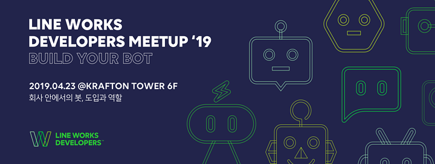
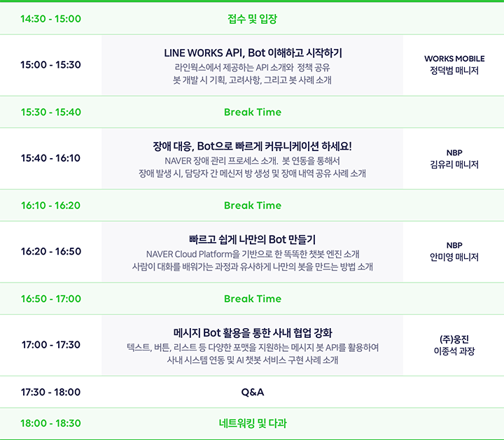

# Developers Meetup 2019

* 주최: [LINE WORKS](<https://line.worksmobile.com/>)
* 일시: 2019/04/23 15:00 ~ 18:30
* 장소: 경기도 성남시 분당구 분당내곡로 117, 크래프톤타워 6층

## About

모바일 비즈니스 환경에서는 Bot을 활용하여 업무 효율성을 더욱 향상시킬 수 있습니다.

하지만, 업무에 Bot을 도입하고 활용하는 것이 아직은 어려운가요?

 

LINE WORKS Developers Team이 두번째 Meetup을 통해 여러분의 어려움을 해소해 드리겠습니다.

이번 Meetup은 **‘회사 안에서의 Bot, 도입과 역할’** 이라는 주제로 진행됩니다.

 

아직 Bot을 도입하지 않은 분들께서는

본격적인 도입에 앞서 LINE WORKS가 제공하는 Bot 빌드 환경과 대화형 인터페이스,

그리고 보안 수준을 확인할 수 있는 자리가 될 것이며

 

Bot 활용법에 대해 궁금하신 분들께서는

준비된 다양한 도입 및 활용 사례와 공유 가능한 리소스를 바탕으로

다양한 Bot 활용 팁을 얻어 가실 수 있는 자리가 될 것입니다.

 

일본내 비즈니스 협업 플랫폼 시장 점유율 1위를 달성하고, 글로벌 2만 고객사가 활용하고 있는

LINE WORKS Bot과 함께 스마트하고 안전한 협업 환경을 만들어보세요.

 

이번 Meetup에 참석하여 귀사의 업무에 Bot을 도입 및 활용해 보세요.

## Content

### 다과 및 음료

> 빵이 역대급으로 맛있었다...

### LINE WORKS API, Bot 이해하고 시작하기 / WORKS MOBILE 정덕범 매니저

> 라인웍스에서 제공하는 API 소개와 정책 공유 봇 개발 시 기획, 고려사항, 그리고 봇 사례 소개

#### Intro

1. 서비스 철학
   1. 보안
   2. 비즈니스 연속성
      * API 변경 시 대응 필요 
   3. 서비스 안정성
      * SaaS Service 이기 때문에 다른 유저에게 영향을 끼칠 수 있음
2. 어떤 것이 가능한가?
   1. Bot

      * Bot Interface를 통해 LINE WORKS 외부와의 통합
   2. SSO (OAuth, SAML)
   3. SAML Apps
   4. IPT
      * IPT 설정으로 통화 가능 상태를 확인

      * UI 클릭을 통해서 전화걸기 가능
   5. 조직연동 가능

#### API 종류와 이해

1. 서버 API와 서비스 API
   1. 다루는 데이터가 구성원의 데이터인가, 회사의 데이터인가 (로그인해서 접근 가능한 데이터 범위)
   2. 구성원 데이터
      * 메일

      * 캘린더

      * 드라이브
   3. 회사 데이터
      * 회사 정보

      * 조직, 직책 정보

      * 어드민 설정
2. API 보안
   1. 3중 보안

      * Key의 사용/관리는 고객사가 하는 것으로 인식

      * 위탁 업무를 진행하는 경우는 Consumer Key에 호출 권한 부여

      * Token의 유효 기간 조정 조치 필요
   2. API ID

      * 테넌트
   3. Consumer Key

      * 서버 / 서비스 허출 범위 제어
   4. Token 

      * User / IP / ID (JWT 표준)

#### API Policy

1. 어떤 API가 제공되고, 어떤 사양으로 제공되는가?
   * 모든 기능이 API로 제공되는 것은 아님

   * 고객의 요구와 내부 검토를 통해 신규 API 제공 여부를 결정

   * 서비스 UI 기준으로 API를 Design

   * 서비스(기능)가 변경되면 API도 함께 변경 (제공/변경 시점과 다를 수 있다)
2. API Life Cycle
   * Design -> Release -> Deprected (통상 1년) -> Retired

   * SaaS 서비스 특성 상 지속적인 개선

   * API의 변화는 불가피

   * UI와 달리 API는 서비스 제공축에 의한 일괄 적용은 불가능 (일정 기간 하위 호환성을 제공)

#### Message Bot을 시작하기 전에

1. Bot API 사용 현황
   * 전체 대화의 2.8%가 Bot이 보낸 메시지

   * Bot을 만들어서 사용중인 기업은 13.8%가 Bot이 보낸 메시지
2. Bot 형태 : 대화 방식
   * Bot 도입 시 간단하고 효율적인 방식은 Bot으로 처리하는 것 (SMS, 메일 대체)

   * Bot에게 알림 외 일을 주려면, 대화가 가능하도록 서버를 마련할 필요가 있음 (callback url 등록)
3. 어떤 역할의 사람이 필요한가?
   1. 기획
      * 어떤 Bot이 회사에 필요할까?

      * 어떤 시나리오로 Bot을 사용하면 좋을까?
   2. 운영
      * 우리 회사에서는 어떤 Bot을 운영해야 할까?

      * 보안은 문제 없을까?

      * 어떻게 교육 해야하지?
   3. 개발

      * 어떻게 구현해야 할까?
4. Bot 타입
   1. 알림형
      * 필요구현요소: -

      * 예시사례: 고객 주문 알림

      * 구현난이도: 하
   2. 자연어 대화형
      * 필요구현요소: 자연어 처리 

      * 예시사례: FAQ 고객 관리 매뉴얼

      * 구현난이도: 상
   3. 템플릿형
      * 필요구현요소: 시나리오 정의

      * 예시사례: 물품 주문

      * 구현난이도: 중
   4. 이미지 처리형
      * 필요구현요소: OCR 프로세스

      * 예시사례: 영수증 처리 명함 관리

      * 구현난이도: 상
   5. 비서형
      * 필요구현요소: 시나리오 정의 

      * 예시사례: 예약

      * 구현난이도: 상
5. 테스트 / 공개
   * 테스트용 Bot과 실제 운영용 Bot 2개 생성 (테스트는 비공개 상황에서 진행하는 것을 권장)

   * 공개로 전환하는 경우 Bot과 대화 가능한 구성원에게 시스템 메시지가 전송됨

#### 산업군별 Bot 사례

1. 2nd Factory ('바다의 집'이라는 요식업 체인을 운영)

   1. POS 데이터 연계
      * 일별 업무 마감 후 매출 데이터가 자동으로 Bot을 통해 통지
   2. IoT 활용
      * 화장실 활용 빈도 센서 부착 후 일정 횟수 이상일 경우 화장실을 청소하도록 Bot으로 통지
2. Milbon (모발 관리용 화장품)
   1. Bot Interface (Mobile Transform)
      * 설비 예약은 PC에서 진행, 시간이 오래 소요되서 Bot을 통한 모바일 접근이 가능하여 획기적으로 시간 단축
3. Hinoki (고객 맞춤 주택 등 부동산업을 운영)
   1. 내부 매뉴얼의 Bot화
      * 고객응대 화법 등의 매뉴얼이 1,400건이 존재하였으나 잘 활용되지 못하고 있었음

      * IBM Watson으로 학습시키고, LINE WORKS Bot을 통해 자연어로 검색하여 원하는 결과를 구성원이 빠르게 찾고 활용
4. 치바대학병원
   1. Bot을 통한 긴급 상황 전파
      * 기존의 SMS를 대체하여 제공

      * 달라진 점은 Bot을 통한 즉시 응답 취합, 응답에 따른 처리 현황을 Bot을 통해서 확인 가능

### 장애 대응, Bot으로 빠르게 커뮤니케이션 하세요! / NBP 김유리 매니저

> NAVER 장애 관리 프로세스 소개
>
> 봇 연동을 통해서 장애 발생 시, 담당자 간 메신저 방 생성 및 장애 내역 공유 사례 소개

#### 장애관리소개

1. NAVER 장애관리체계
   1. 회사의 서비스 및 운영과 고나련도니 모든 장애를 신속하게 처리하고, 문제 해결을 통해 예방하기 위한 조직, 프로세스, 도구의 결합
   2. Process
      * 장애감지 - 종료까지
   3. Organization
      * 장애센터
   4. Tool
      * 장애관리 모니터링
2. 전담 장애관리조직
   1. 장애센터를 중심으로 장애 해결에 참여하는 구조: 장애에 대한 총제적인 관리 및 창구 단일화
   2. 장애센터
      * 장애 관제 부서

      * 장애 관리 부서
   3. 직원
      * 고객센터

      * 서비스 담당자

      * 경영진, 홍보
3. 업무 프로세스

   * 장애감지부터 종료까지 필요한 모든 활동, 역할, 방법을 정의하고 적용
4. 장애관리 시스템
   1. TTS(Trouble Ticket System) 장애관리 시스템
      * 신속 정확한 장애관리를 위한 업무프로세스를 자동화 하고, 조직관 커뮤니케이션을 위한 도구

      * 장애 프로세스 처리

      * 서비스 및 담당자 관리

      * 장애 이력 관리
   2. 장애모니터링 시스템
      * 사용자 관점의 Simultation을 통해 서비스 상태 및 품질 수준을 모니터링

      * 장애 발생 즉시 TTS를 통해서 서비스 담당자에게 전파
   3. 통합 장애관제 대시보드

      * 서비스 및 인프라(시스템, DB, 네트워크)의 이벤트를 한곳에 모아 타임라인 기반으로 보여줌

#### Bot의 활용

1. 장애 메신저 프로세스
   1. Before & After
      1. 장애 발생 후 빠른 담당자 소집 및 커뮤니케이션이 가능해졌음
      2. Before
         * 메신저 소집 방신: 수동

         * 메신저 방 생성 시간: 장애발생 전파 후 1분 ~ 7분

         * 부재중 담당자 초대: 부재 중에도 초대됨
      3. After
         * 메신저 소집 방신: Bot 연동을 통한 자동화

         * 메신저 방 생성 시간: 장애발생 전파 후 즉시

         * 부재중 담당자 초대: 주재 중에는 위임자가 대신 초대됨

#### Bot 활용의 확장 (Plan)

1. 멤버 추가 기능
   * 장애가 확대되어 더 많은 담당자 초대
2. 티켓처리 알림에도 확대 적용
   * 장애관제팀의 빠른 티켓처리를 위한 알림용으로 적용

### 빠르고 쉽게 나만의 Bot 만들기 / NBP 안미영 매니저

> NAVER Cloud Platform을 기반으로 한 똑똑한 챗봇 엔진 소개
>
> 사람이 대화를 배워가는 과정과 유사하게 나만의 봇을 만드는 방법 소개

#### @@Bot 만들어 볼까

1. 나만의 봇 기획하기

   1. 나만의 다이어트 띵언 봇 만들어 보자
   2. 봇의 컨셉, 기능 범위 설정
      * 배고플 때 불러보는 봇

      * Hot한 다이어트 제품 추천해주는 봇

      * 요가 동영상 알려주는 봇
   3. 서비스 채널 설정
      * 메신저에 붙여요

      * 음성 지원 안 할래요
   4. 답변 커버리지

#### 네이버 클라우드 플랫폼 챗봇 서비스

> 쉬워요, 자연어 처리, 챗봇운영

1. 대화 모델링
   1. 어설프게 사람을 따라하는 인공지능이 아닌, 자연스럽고 풍부한 대화 경험을 설계할 수 있어야 한다.
   2. AI = 최첨단 노가다
   3. 그래서 최신의 머신러닝 기반 모델을 적용하여 발화 의도를 파악하고 맞는 답변을 제공 한다.

      * 처음 챗봇을 구성할 때는 FAQ 형식의 기본 질문, 이에 맞는 답변을 등록
   4. 운영자의 설정이 아닌 챗봇 엔진이 최적의 답변을 제공할 수 있도록 설계하고 있다.
   5. 대화 생성 - 질문, 답변 관리
      * 질문 답변 관리

      * 조건별 답변

      * 답변 Type

      * 미리보기
   6. 두루뭉술한 질문에 답변을 하는 방법
      * 유사 답변과 실패 메시지

      * 시스템 오류 메시지
   7. 분석된 대화 및 대화 유형/엔티티 결과 제공
   8. 다양한 답변 형탸 구성
      * 기본 답변

      * 멀티 링크 답변

      * 조건 답변

      * 객관식 답변

      * 이미지 답변

      * 메신저 별 응답 설정
2. 챗봇 운영관리
   1. 챗봇 만들었는데 얼마나 쓰고 있지?
      * 통합 지표

      * 피드백 지표

      * 순위 지표

      * 조건 검색
   2. 효과적인 재학습 Flow 제공: 도대체 어떤 대화에서 대화가 끊기는 걸까?
      * 실패 대화

      * 불만족 대화

      * 대화 운영 및 관리
   3. 자동 테스트 및 작업 관리: 내 챗봇의 답변률은 얼마일까?
3. 빠르게 내 봇 만들기
4. 행사도우미 봇

#### 비즈니스 오피스 봇의 미래

1. 사용자 Interaction과 Interface
   * 어떤 앱이 내 플랫폼의 @@BOT과 호환될까?
2. 봇스토어
   * 수 만가지 App을 설치하는 곳 'App Store', 그리고 '봇 스토어, 봇 마켓 플레이스'
     * BotList
     * Chatbottle
3. [봇 구현 참고 자료](https://blog.naver.com/n_cloudplatform)

### 메시지 Bot 활용을 통한 사내 협업 강화 / (주)웅진 이종석 과장

> 텍스트, 버튼, 리스트 등 다양한 포맷을 지원하는 메시지 봇 API를 활용하여 사내 시스템 연동 및 AI 챗봇 서비스 구현 사례 소개

#### (주)웅진 회사소개

* LINE WORKS 서비스를 포함한 Total IT Service를 핵심 사업 영역으로 하고, 여러 기업의 정보시스템의 구축 담당

#### Bot 구현하기에 앞서

1. 어디에 적용하지?
   * 간단한 업무부터

   * 푸시알림
2. Bot은 규칙 기반(Rule)

   * 시나리오 작성이 중요
3. 비용은? 개발기간?

   * 인턴사원이 2개월 동안 사내 FAQ 개발

#### Bot 구현 사례

1. 정해진 대상자에게 공지 알림

   * 메시지 봇, 내용, 대상자를 선택 및 입력하여 메시지를 발송
2. 전자결재 진행 알림

   * 결재 상신, 완료, 반려 등 현재 진행 상태에 대해 알림을 발송
3. 게시물 등록 알림
   * 읽기 권한이 있는 사용자에게 게시물 등록 알림 발송

   * 대글 및 답글이 작성되면 원문 등록자에게 등록 알림 발송
4. Callback 기능을 활용한 자동응답

   * 미리 설정해둔 키워드에 맞춰서 설정해둔 메시지 리턴

#### Bot 확장

1. MessageBot과 ChatBot 직접 연동
   * ChatBot 시나리오 등록

   * MessageBot과 ChatBot 연결 설정
2. MessageBot과 ChatBot 연동 시 중간에 I/F 서버를 두고 연동

   * Chatbot 시나리오 등록 및 연동 키 발급하여 I/F 서버에서 사용할 수 있도록 설정

1. 그 외 더 생각해 볼 수 있는 사례
   * 간편 결재

## Review

라인웍스를 사용하고 있거나, 도입할 예정인 분들이면 굉장히 유익한 내용일거 같다.

나는 라인웍스를 사용하지 않아서 별로...

내용은 좋았다.

가장 기억에 남는건 간식이 웬만한 빵집보다 맛있어서 놀랐다...

맛집 인정
