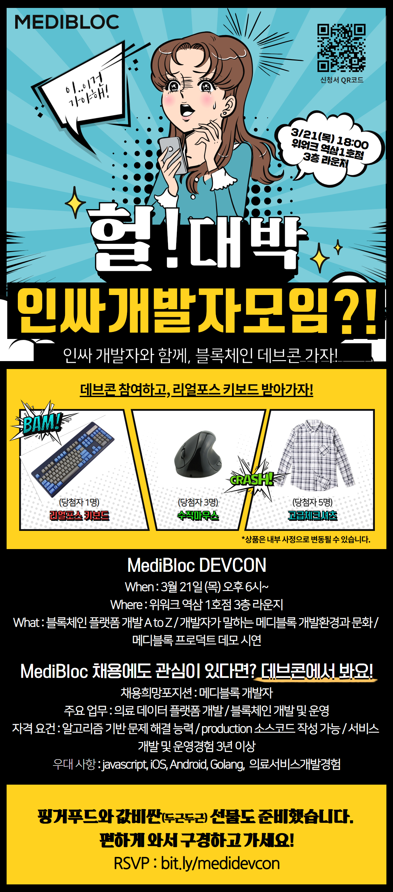
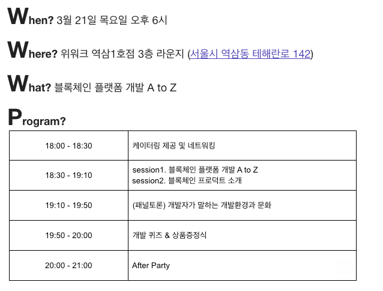

# DevCon. The 1st.

- 주최: [MediBloc](https://medibloc.org)

- 일시: 2019/03/21 18:00 ~ 21:00

- 장소: 위워크 역삼 1호점 3층 라운지 (서울시 강남구 역삼동 테헤란로 142)

## About

## Content

### 식사

> 햄버거, 치킨, 감자 칩, 콜라, 맥주, ...

### Ice Breaking

간단한 퀴즈식으로 진행

문제는 따로 저장을 못 했지만 개인적으로 어려운 문제가 많았음

[Kahoot](https://kahoot.it/) 이라는 서비스로 진행했는데 너무 재밌었음

## 블록체인 플랫폼 개발 A to Z / 블록체인 프로덕트 소개

1. 다 같이 고민하는 시간

   1. 미래의 의료는 어떻게 될지 고민

      * 진료를 받으면 모바일 장치 등으로 전달

      * 전자 처방전으로 약을 구매

      * 보험사에 자동으로 전송하여 청구 진행

      * 이러한 서비스를 위해서는 병원끼리 데이터를 공유해야 함

   2. 병원끼리 데이터를 공유하며 발생하는 문제

      * 연동되는 주체(은행, 약국, 보험사, ...)들이 너무 많음

      * 기관 연합이 생겨 이익을 위해 데이터를 독점하는 상황이 생길 수 있음

   3. 데이터 관리자와 주인이 다름 (병원 <> 개인)

      * 개인을 중심으로 데이터 공유

      * 개인에게 데이터를 줄 때 데이터 변조 방지 필요

2. 고민했던 문제를 해결할 수 있는 방법

   1. 블록체인

      1. 데이터 진본 증명

         * 해시 생성

         * 데이터의 해시 값은 역으로 생성하기 어려움

         * 데이터의 해시 정보를 기관의 서명과 함께 블록체인에 기록

         * 개인이 데이터를 공유하는 과정에서 블록체인의 남겨진 해시 정보를 통해 진본 증명

      2. 데이터의 비식별화

         * 개인이 진료 기록 중 일부의 정보만 전달하고 싶을 수 있음

         * 진료 기록의 일부만 전달하면 진본 증명을 할 수 있는 방법이 필요

         * 일부만 전달하면서 진본 증명하는 방법이 필요

         * 데이터를 머클화하면 됨

         * 머클트리 구조로 일부 해시값으로 전체 증명 가능

         * Merklized JSON

3. 메디블록은

   * 위에서 고민했던 내용들에 대한 것들을 개발하고 있으며

   * 먼 미래가 아닌 근래에 메디블록 프로덕트가 해낼 수 있다

   

### 개발자가 말하는 개발 환경과 문화

> 패널토론

1. 개발자들이 블록체인에 집중해야하는 이유

   * 앞으로 데이터 관리를 공통으로 관리해야하는 상황이 많이 생김

   * 모든 데이터의 디지털화

   * 이러한 것들을 가능하게 하는게 블록체인 기술

   * 개발자들이 블록체인에 관심을 가져야하는 이유

2. 메디블록에게 블록체인이란

   * 의료 정보에 관련된 시스템

   * 신뢰가 핵심

   * 생산자와 보유자와 소비자를 묶어줌

3. 메디블록을 선택한 이유

   * 의료산업의 개발자가 되는 것은 많은 특혜가 있음

   * 의료산업은 기회가 매우 많다 (기회의 땅)

   * 토스가 금융이라는 도메인에서 성공하여 유니콘 기업이 된 것처럼 메디블록은 의료 도메인에서 유니콘이 되겠다

4. 대기업과 스타트업의 차이

   * 사용자들을 위한 서비스를 만든다는 본질은 같다

   * 프로세스나 자유 등 환경의 차이는 있지만 매우 사소한 차이

   * 어느 환경에서나 노력하면 뭐든 이룰 수 있다

5. 빠르게 개발 역량을 쌓는 팁

   1. 잘 짜여진 코드를 봐야 한다

   2. 이해가 안 돼도 일단 보고 자면 어느 정도 이해된다(??)

      (머리에 박아 넣자)

6. 메디블록이 제공한 기회

   1. 처음 입사했을 땐 개발에 대해 거의 몰랐지만 (비전공자) 계속 기회를 받음

   2. 계속 필요한 것을 찾고 공부하고 해내면서 초스피드로 성장할 수 있었음

      (스스로 성장에 관심이 없으면 메디블록과 함께하지 못하니 돌아가도록!)

7. 시니어가 놓치지 말아야 할 것

   1. 장점

      * 지금까지 쌓았던 경험으로 프로젝트를 빠르게 진행할 수 있음

      * 문제를 고려하며 시스템을 설계하고 구현할 수 있음

   2. 단점

      * IT분야가 다른 산업에 비해 늦게 시작됐기 때문에 빠르게 변화함

      * 현실을 안주하면 개발자로서의 성장은 멈춤

      * 새로운 도전을 끊임없이 해야함

      * 주니어들 처럼 깨달음이나 배움의 갈망을 잃지 않도록 주의

      * 즉 호기심을 유지하라

8. 1년 후 자신이 생각하는 가장 이상적인 모습은?

   * 메디블록은 2가지 측면에서 새로운 시도를 하고 있음

     1. 블록체인

     2. 의료

      * 1년 뒤는 잘 모르겠고 메디블록이 성공하여 몸값이 높은 개발자가 될듯

      * 은 장난이고 세상을 바꿀 수 있는 개발자

      * 면서 몸값 높은 개발자

### Q/A

1. 노드 관리는 어떻게 하고 있나요

   > DPOS 방식으로 21개 노드가 관리

2. 노드 관리 주체는 어떻게 되나요?

   > 지금은 자체 관리로 진행하며, 나중은 투표를 통해 진행하는 등 방향으로 바꿀듯

   

3. 사수가 없는 스타트업에서 혼자 개발하고 있는데 조언부탁드립니다

   > 옛날에 비해 사수의 중요성이 많이 사라짐
   >
   > 지금 열심히 하시는 모습처럼 계속한다면 뭐든 가능함
   >
   > 같이 고민할 수 있는 사람들을 구하는 것도 방법

   

4. 메디블록은 병력특례가 가능한가요?

   > 신청 중입니다 (대표님 들으셨죠?)

   

5. 메디블록이 진행하는 서비스도 일종의 플랫폼 사업인데, 플랫폼 특징상 승자독식으로 될텐데 그러한 것에 대한 대비책이 있는지?

   > 병원, 보험사 등 보수적인 시스템과의 연결, 블록체인 시스템 등으로 진입장벽이 굉장히 높음
   >
   > 이러한 시스템의 성숙성으로 넘사벽을 만들 예정

   

6. 신입을 채용할 때 어떤 프로세스가 있는지 (코딩테스트? 포트폴리오?)

   > 다른 회사와 아주 다르진 않고 코딩테스트 위주로 진행
   >
   > 블록체인 관련 프로젝트 등이 있다면 가산점이 높음

   

7. QRC -> ERC로 넘어간 이유는?

   >  거래소 상장 때문

   

8. 병원 데이터가 공유되는 것은 법적 이슈가 있는데 어떻게 처리하시는지?

   > 개인의 정보가 개인의 의사로 사용되는 것은 문제가 없음

   

9. 노드 수 확보는 어떤 식으로 하실 예정인지?

   > 협력하는 기관이 많고 같이 노드를 운영할 예정
   >
   > 자세한 정보는 영업비밀

10. 법률적으로 의료 정보는 하드카피만 유용하지 않나요?

   > 디지털로 받더라도 하드카피와 같은 법률해석 가능

### 개발 퀴즈

많이 틀린 건 아니지만 다른 분들이 너무 잘해서 아무것도 못 받음...

## Review

지금까지 갔던 컨퍼런스 중 가장 재밌었던거 같다

맥주를 먹으며 자유롭게 진행하는 것도 그렇고, 진행하시는 분이 슈퍼인싸라서 그런거 같기도 하고

특히 [Kahoot](https://kahoot.it/)으로 진행했던 퀴즈가 신박하고 재밌었음

사회에 기여할 수 있는 좋은 서비스인거 같다
