# Armeria: A Microservice Framework Well-suited Everywhere

## About

> Armeria는 Netty 프로젝트의 창시자가 이끄는 팀이 개발한 오픈 소스 자바 HTTP/2 마이크로서비스 프레임워크입니다. 본 강연에서는 여러분의 마이크로서비스 개발을 도울 Armeria의 독특한 특징을 소개합니다.
>
> gRPC나 Thrift 서비스를 HAProxy, Prometheus, Zipkin, Spring WebFlux와 같이 여러 분이 즐겨 쓰시는 컴포넌트와 통합하고 싶으신가요? Swagger나 Postman같은 웹 콘솔이 gRPC나 Thrift에도 있었으면 하나요? 사이드카나 프록시 설정이 너무 복잡한가요? 기존 서비스를 좀 더 모던한 비동기 RPC로 마이그레이션하고 싶나요? gRPC, Thrift, REST, 정적 파일, 심지어는 서블릿도 함께 구동해야 하나요?
>
> 이 질문 중 하나에라도 호기심이 동하셨다면, 시간을 낼 가치가 있는 강연임을 자신합니다. 오셔서 Armeria의 개발 철학은 무엇이고 마이크로서비스를 개발하면서 겪는 골치아픈 문제들을 어떻게 해결하고자 하는지 간단한 예제와 함께 살펴보세요.

발표자: 이희승 / LINE+

## Content

### 왜 또 다시 마이크로 서비스 프레임워크를 만들었는가?

* Simple & User-friendly
* Asynchronous & Reactive
* 1st-class RPC support
  * … with better-than-upstream experience
* Unopinionated integration & migration
* Less points of failure

### 예제코드

#### Hello, world!

```java
Server server = Server.builder()
  .http(8080)
  .https(8443)
  .tlsSelfSigned()
  .haproxy(8080)
  .service("/hello/:name", (ctx, req) -> HttpResponse.of("Hello, %s!", ctx.pathParam("name")))
  .build();

server.start();
```

#### Hello, world – Annotated

```java
Server server = Server.builder()
  .http(8080)
	.annotatedService(new Object() {
    @Get("/hello/:name")
    public String hello(@Param String name) {
      return String.format("Hello, %s!", name);
    }
  })
  .build();

server.start();
```

#### gRPC

```java
Server server = Server.builder()
  .http(8080)
	.service(GrpcService.builder()
           .addService(new GrpcHelloService())
           .build())
  .build();

class GrpcHelloService extends HelloServiceGrpc.HelloServiceImplBase {
	...
}
```

#### Thrift

```java
Server server = Server.builder()
  .http(8080)
  .service("/hello", THttpService.of(new ThriftHelloService()))
  .build();

class ThriftHelloService implements HelloService.AsyncIface {
	...
}
```

#### Mix & Match!

```java
Server server = Server.builder()
  .http(8080)
  .service("/hello/rest", (ctx, req) -> HttpResponse.of("Hello, world!"))
  .service("/hello/thrift", THttpService.of(new ThriftHelloService()))
  .service(GrpcService.builder()
           .addService(new GrpcHelloService())
           .build())
  .build();
```

### 왜 비동기 반응형으로 개발을 하는가?

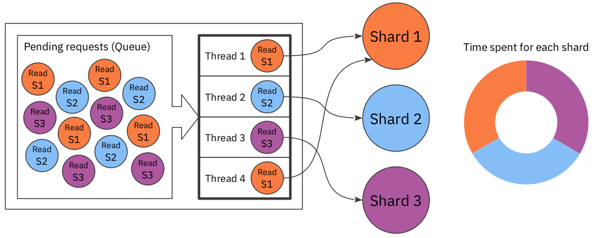

#### 만약 Shard가 죽는다면?

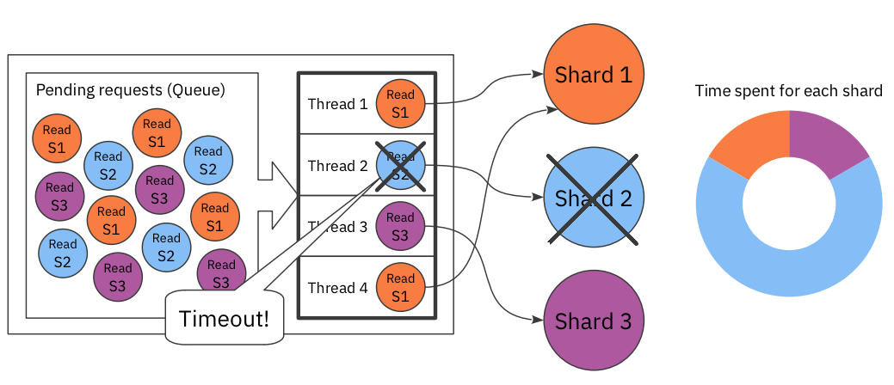

#### 문제가 발생할 수 있다.

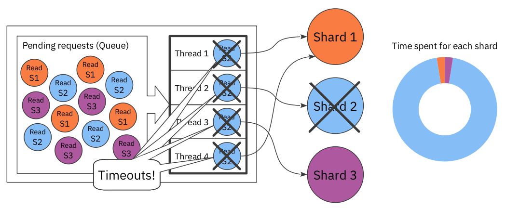

#### 장애가 전파된다.

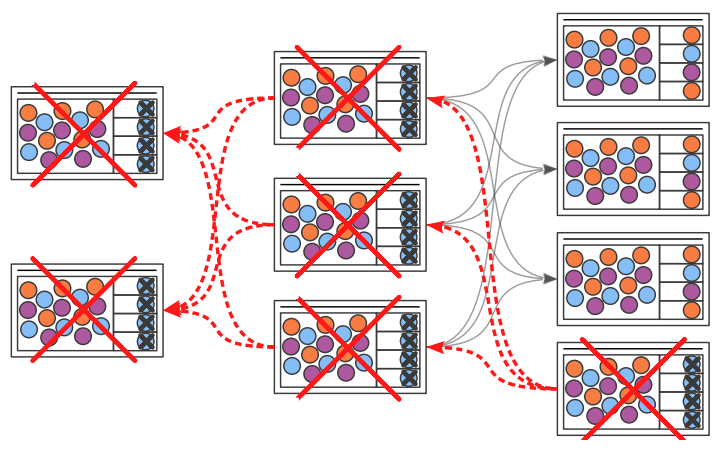

#### 해결 방법은?

1. CPU 갯수를 늘리면?
   * 놀기만 할듯
2. 쓰레드를 늘리면?
   * 늘린 쓰레드 모두 Shard2에 걸릴듯
   * CPU 사이클 및 메모리에 비효율적
     * 컨텍스트 스위칭 비용
     * 콜 스택
3. 결론
   * 동기로 구현하게 된다면 작은 장애에도 취약하다.
   * 해결하려 해도 더 많은 메모리와 더 많은 CPU를 사용해서 비효율적으로 처리해야 한다.
4. 위 처럼 해결해도 계속해서 튜닝하고 수정해야 합니다.
   * 스레드 수를 늘리거나 콜 스택 사이즈를 줄이거나...
   * 수정에 맞춰 계속 수정해줘야 한다.. ㅠㅠ
5. 그냥 비동기식으로 가면?
   * 비동기식으로 처리하면 튜닝할 부분이 적다.
     * 메모리 사이즈 & 이벤트 루프
   * 동시 호출 시 적은 스레드로 더 나은 처리를 할 수 있다.

#### 큰 데이터를 처리할 땐 어떻게 해야할까?

1. 블러킹일 때 문제는 해결할 수 있지만, 10만명의 유저가 10MB의 요청을 한다면 어떻게 해야할까?
   * RAM에서 처리할 수 없는 양의 데이터 – 10MB × 100K = 1TB
2. 더 빨리 보낸다면?
   * 다른 대역폭 & 처리 능력
3. 버퍼링을 사용하여 처리가 가능하다.
   * 버퍼링이 없다면 OOME가 발생할 수 밖에 없다.

#### Traditional vs. Reactive

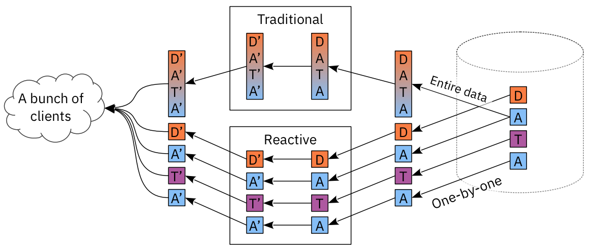

#### Reactive HTTP/2 proxy in 6 lines

```java
// Use Armeria's async & reactive HTTP/2 client.
HttpClient client = HttpClient.of("h2c://backend");
Server server = Server.builder()
  .http(8080)
  .service("prefix:/", (ctx, req) -> client.execute(req)) // Forward all requests reactively.
  .build();
```

### 1 st-class RPC support - with better-than-upstream experience

#### RPC vs. HTTP impedance 불일치

* RPC has been hardly a 1st-class citizen in web frameworks.
  * Which method was called with what parameters?
  * What’s the return value? Did it succeed?

#### Killing many birds with Structured Logging

* Timings
  * Low-level timings, e.g. DNS · Socket
  * Request · Response time
* Application-level
  * Custom attributes
    * User
    * Client type
    * Region, …
* HTTP-level
  * Request · Response headers
  * Content preview, e.g. first 64 bytes
* RPC-level
  * Service type
  * method and parameters
  * Return values and exceptions

#### First things first – Decorators

```java
GrpcService.builder()
  .addService(new MyServiceImpl())
  .build()
  .decorate((delegate, ctx, req) -> {
    ctx.log()
      .addListener(log -> {
        ...
      }, RequestLogAvailability.COMPLETE);
    
    return delegate.serve(ctx, req);
 });
```

* Decorators are used everywhere in Armeria
  * Most features mentioned in this presentation are decorators.

#### Async retrieval of structured logs

```java
ctx.log()
  .addListener(log -> {
    long reqStartTime = log.requestStartTimeMillis();
    long resStartTime = log.responseStartTimeMillis();
    RpcRequest rpcReq = (RpcRequest) log.requestContent();
    
    if (rpcReq != null) {
      String method = rpcReq.method();
      List<Object> params = rpcReq.params();
      RpcResponse rpcRes = (RpcResponse) log.responseContent();
      
      if (rpcRes != null) {
        Object result = rpcRes.getNow(null);
      }
    }
  }, RequestLogAvailability.COMPLETE);
```

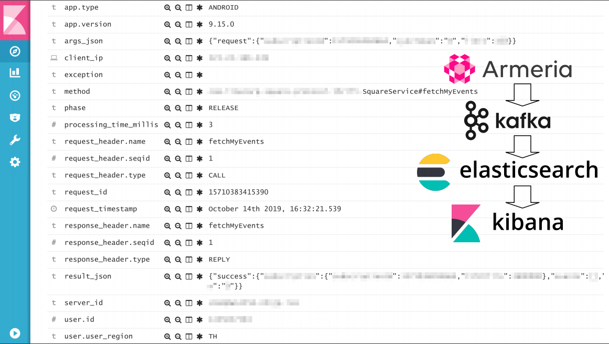

#### Making a debug call

* Sending an ad-hoc query in RPC is hard.
  * Find a proper service definition, e.g. .thrift or .proto files
  * Set up code generator, build, IDE, etc.
  * Write some code that makes an RPC call.
* HTTP in contrast:
  * cURL, telnet command, web-based tools and more.
* What if we build something more convenient and collaborative?

#### Armeria documentation service

* Enabled by adding DocService

* Browse and invoke RPC services in an Armeria server

  * No fiddling with binary payloads
  * Send a request without writing code

* Supports gRPC, Thrift and annotated services

* We have a plan to add:

  * Metric monitoring console
  * Runtime configuration editor, e.g. logger level

  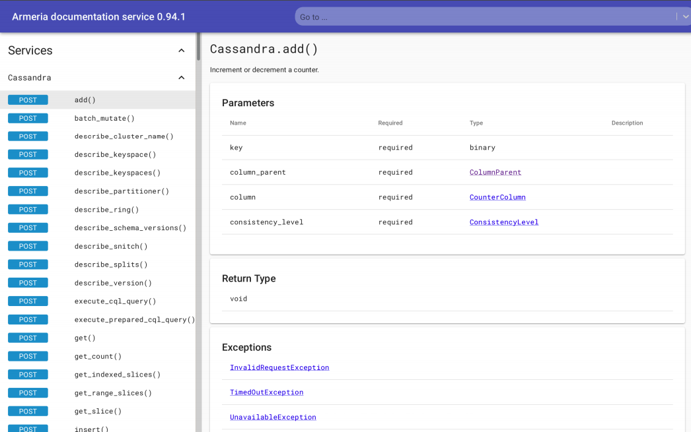

#### Cool features not available in upstream

* gRPC
  * Works on both HTTP/1 and 2
  * gRPC-Web support, i.e. can call gRPC services from JavaScript frontends
* Thrift
  * HTTP/2, TTEXT (human-readable REST-ish JSON)
* Can leverage decorators
  * Structured logging, Metric collection, Distributed tracing, Authentication
  * CORS, SAML, Request throttling, Circuit breakers, Automatic retries, …

#### Cool features not available in upstream

* ● Can mix gRPC, Thrift, REST, Tomcat, Jetty, …
  * on a single HTTP port & single JVM
  * without any proxies
  * REST API
  * Static files
  * Exposing metrics
  * Health-check requests from load balancers
  * Traditional JEE webapps
* Share common logic between different endpoints!

#### Unopinionated integration & migration

##### Armeria ❤ What You ❤

* Use your favorite tech, not ours:
  * DI – , Guice, Dagger, …
  * Protocols – , Thrift, REST, …
* Choose only what you want:
  * Most features are optional.
  * Compose and customize at your will.
    * Your application grows with you, not by its own.

#### Case of Slack

* Using Thrift since 2015
* Migrated from Thrift to gRPC
  * Can run both while clients are switching
* Leverages built-in non-RPC services:
  * PrometheusExpositionService
  * HealthCheckService
  * BraveService
  * Distributed tracing with honeycomb
  * DocService

#### Case of Line

* In-app emoji · sticker store (50k-100k reqs/sec)

* Before:

  * Spring Boot + Tomcat (HTTP/1) + Thrift on Servlet
  * Apache HttpClient

* After – Migrate keeping what you love

  * Spring Boot + (HTTP/2)
  * Keep using Tomcat via TomcatService for the legacy
  * Thrift served directly & asynchronously = No Tomcat overhead
  * Armeria’s HTTP/2 client w/ load-balancing

  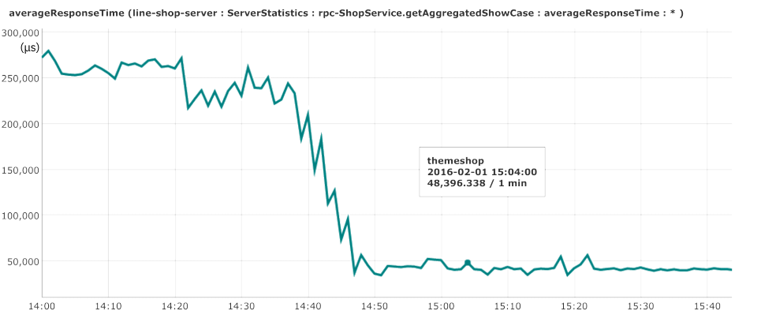

  * Asynchronification of 3 synchronous calls

  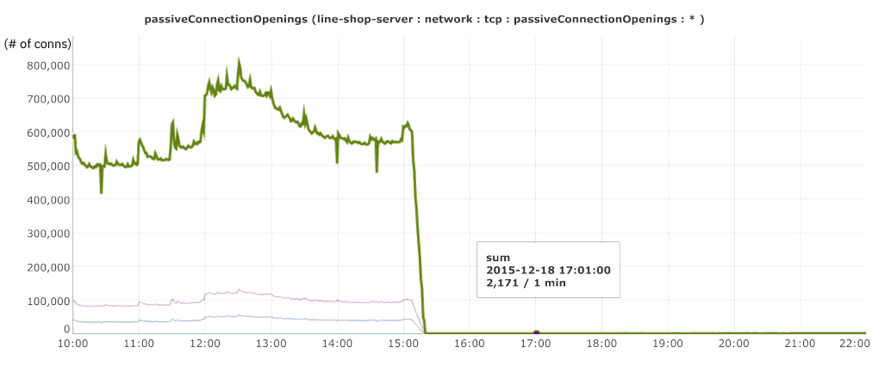

  * Significant reduction of inter-service connections

  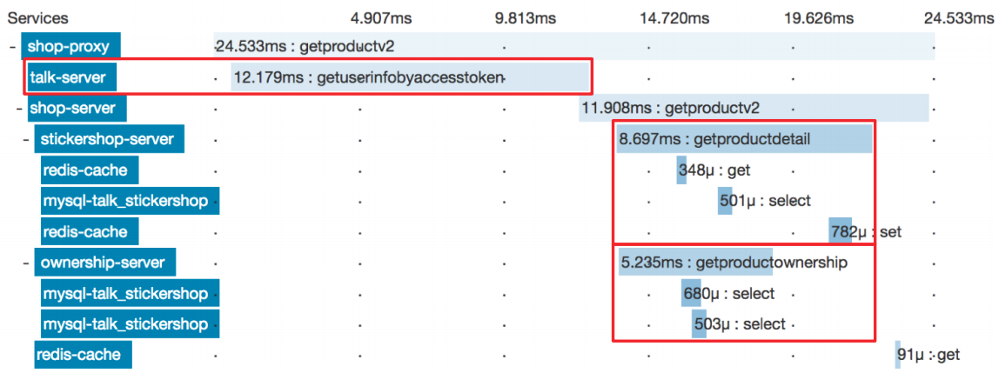

  * Distributed tracing with ZIPKIN by just adding BraveService

#### Case of kakaopay

* Firm banking gateway
  * Talking to Korean banks via VAN (value-added network) 
  * ● Kotlin + Armeria
    * Mostly non-null API
    * Using @Nullable annotation extensibly
  * Spring WebFlux + gRPC
  * Armeria Replaces Spring’s network layer (reactor-netty)
  * gRPC served directly = No WebFlux overhead

### Less points of failure - Client-side load-balancing

#### Load balancers · Reverse proxies

* Pros
  * Distributes load 
  * Offloads TLS overhead 
  * Automatic health checks 
  * Service discovery (?)
* Cons
  * More points of failure
  * Increased hops · latency
  * Uneven load distribution
  * Cost of operation
  * Health check lags

#### Client-side load balancing

* Client-side load balancing
  * Chooses endpoints autonomously
  * Service discovery – DNS, k8s, ZooKeeper, …
  * Near real-time health checks
  * Less points of failure
* Proxy-less Armeria server
  * OpenSSL-based high-performance TLS
  * Netty + /dev/epoll
  * Assemble your services into a single port + single JVM!

#### HTTP/2 load distrubution at LINE

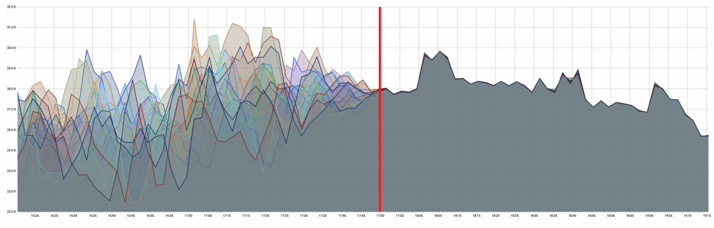

#### Near real-time health check

* Leverage HTTP/2 + long-polling
  * Significantly reduced number of health check requests, e.g. every 10s vs. 5m
  * Immediate notification of health status
* Server considered unhealthy 
  * On disconnection
  * On server notification, e.g. graceful shutdown, self-test failure
* Fully backwards-compatible 
  * Activated only when server responds with a special header

#### Client-side load-balancing with auto-retry and circuit breaker in 8 lines

````java
// Kubernetes-style service discovery + long polling health check
EndpointGroup group = HealthCheckedEndpointGroup.of(DnsServiceEndpointGroup.of("my-service.cluster.local"), "/internal/healthcheck");

// Register the group into the registry.
EndpointGroupRegistry.register("myService", group, WEIGHTED_ROUND_ROBIN);

// Create an HTTP client with auto-retry and circuit breaker.
HttpClient client = HttpClient.builder("http://group:myService")
  .decorator(RetryingHttpClient.newDecorator(onServerErrorStatus()))
  .decorator(CircuitBreakerHttpClient.newDecorator(...))
  .build();

// Send a request.
HttpResponse res = client.get("/hello/armeria");
````


### Future work - Consider joining us!

#### The road to 1.0 (and beyond)

* Currently at 0.95
* Hoping to release before the end of 2019
* API stabilization · clean-up
* Post-1.0
  * Kotlin · Scala DSL
  * Evolving DocService to DashboardService
  * More transports & protocols
    * Web Sockets, UNIX domain sockets, Netty handlers, …
  * More decorators
  * More service discovery mechanisms 
    * Eureka, Consul, etcd, … 
  * OpenAPI spec (.yml) generator
  * Performance optimization


## Review

Deview를 신청한 이유면서 가장 듣고싶었던 섹션이였다.

평소에 아르메리아 프로젝트에 관심이 많고 어느정도 내용을 알아서 그런지 발표도 재밌고 이해하기도 쉬워서 좋았다.

이번 년 말에 1.0 릴리즈 될 것 같으니 계속해서 지켜봐야겠다!

자료가 영어라 기억을 더듬으며 한땀한땀 수정하려다가 의미가 없는 것 같아 올립니다 ㅠㅠ..

이번 컨퍼런스 중 가장 만족스럽고 많은 것을 얻어갑니다.