# 네이버 동영상 서비스를 지탱하는 VOD플랫폼 개발기

## About

> 동영상서비스를 만들기 위해서는 동영상 파일의 업로드 부터 트랜스코딩, 패키징, 딜리버리, 재생, 플레이등 많는 기능이 필요하고, 사용자의 다양한 플랫폼 환경에서 끊김없는 최적의 재생 품질을 제공해야 합니다. 이런 기본적인 요구 사항외에도 새로운 동영상 기술을 빠르게 적용하고 점점 고화질, 대용량화 되는 동영상을 효율적으로 저장하고 서비스하는것에 많은 문제와 어려움이 있습니다.
> 
> 본 세션에서는 네이버 동영상 서비스 지탱하고 있는 VOD 플랫폼의 지난 10년간의 성장기를 통해서 24/7/365 고가용성을 확보하기 위한 아키텍처, 분산 시스템에 대한 경험들 , 64개 서비스를 지원하기 위한 플랫폼 개발에 대한 노하우를 소개합니다.

발표자: 조성철 / NAVER / 동영상클라우드1개발

## Content

### 1. VOD서비스에서 고려 사항 

#### VOD 서비스 Flow

1. INGEST
   * 다양한 기기에서 캡쳐
   * 동영상 업로드
2. CONVERT
   * Transcoding
   * Transmuxing
   * 코덱 컨테이너 변환
   * HLS, DASH
3. STORE & DELIVER
   * CDN
   * Streaming
   * AD
   * DRM License
4. PLAYBACK
   * 다양한 환경에서 재생
5. ANALYZE
   * 품질
   * 소비 분석

#### 다양한 환경에서 동영상 재생

- 파편화된 동영상 재생 환경
- 데이터 압축과 컨테이너 변환
- 글로벌 서비스를 위한 딜리버리

#### 대용량 시스템의 운영

* 대용량 파일 업로드와 데이터 전송
* Object Storage 저장 및 관리
* 배포, 모니터링, 장애 대응 등

#### 수익화 및 분석 도구의 개발

* AVOD, SVOD
* 동영상 광고 연동 (VAST, SSAI, DFP)
* 동영상 콘텐츠 보호 (DRM)
* 소비 분석 도구, Analytics

#### Today

###### VOD 플랫폼을 개발하면서 겪은 경험 공유

1. Ingrest
   * 업로드
   * 썸네일
   * 인코딩
2. Playback
   * 플레이어
   * 스트리밍
   * 해상도
3. Monetization
   * 광고
   * DRM
   * SVOD
4. Analytics
   * 재생지표
   * 품질
   * 소비패턴

### 2. 업로드부터 트랜스코딩까지 최적화하기 

#### 동영상 대형화로 나타나는 문제

###### 기존에는 다 잘 되던것들 인데...

* 업로드 오류 증가
* 시스템 트래픽 부담
* 트랜스코딩 지연

###### 업로드 방식의 변화

* 한번에 여러개의 파일을 업로드 하고 싶어요
* 멀티파트 업로드
* 업로더 UI도 서비스에서 직접 구현했으면...

###### 특히, 해외에서 업로드가 이슈

* 해외 CP사에서 대용량 파일을 받기 힘든 상황
* KR POP에만 VOD 플랫폼이 구축
* 해외 POP에서 국내로 재전송하는 구조

###### 업로드 모듈의 기본 컨셉

* 대용량 파일 전송
* 실패 자동 복구
* 멀티파트 업로드
* 개발, 배포가 쉬운 컴포넌트 구조

###### Chunk 단위로 파일을 전송하는 구조

* identifier + session key로 저장

* buffer에서 chunk 생성

* scheduler 통한 전송 구조

  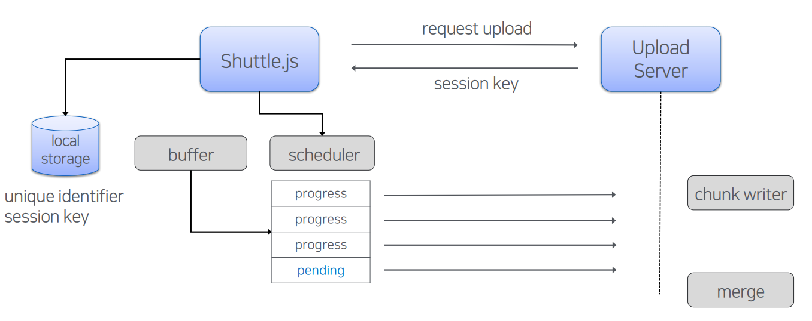

###### Auto-Resume의 동작 방식

* Client, Server 간 전송 list 동기화

* 실패한 Chunk를 전송

  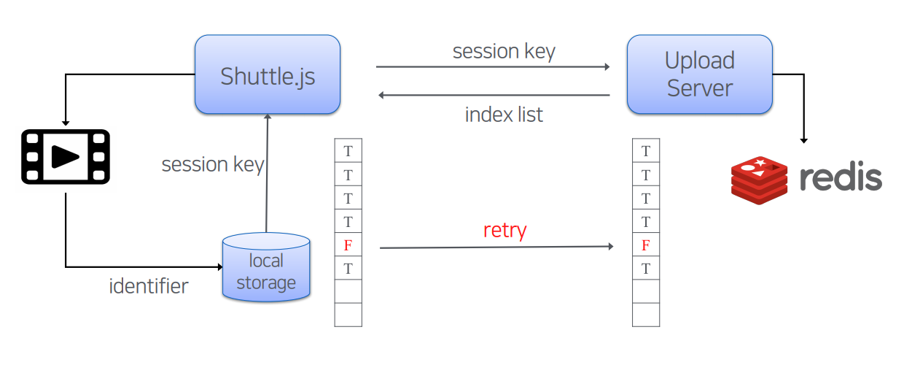

###### 업로드 서버의 Load balancing

* L4, 대용량 트래픽 전송 문제

* GSLB, DNS 캐싱으로 빠른 갱신이 안되는 문제

  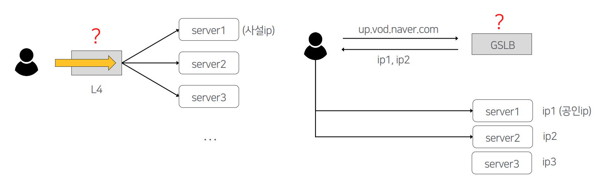

###### GSLB + Eureka를 이용한 방법

* GSLBGeolocation으로 가까운 POP할당

* ServiceDiscovery는 Spring Cloud의 Eureka

  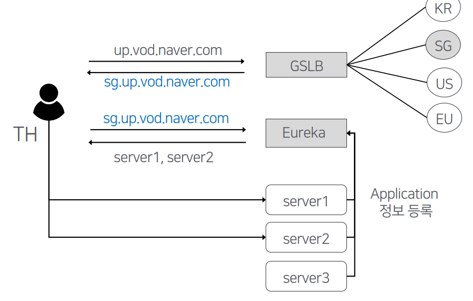

###### 해외 구간의 전송 속도 개선

* 불안정한 로컬 네트워크 환경 (packet less)
* 국내 IDC까지 전송해야 함
* 퍼블릭 인터넷만으로는 업로드 불가능
* RTT 150ms ~ 200ms

###### Global 업로드 구조 개선 #1

* 파일이 커지면 재전송을 위한 대기 시간이 길어짐

* 사용자에게 업로드 후 바로 피드백이 가능

  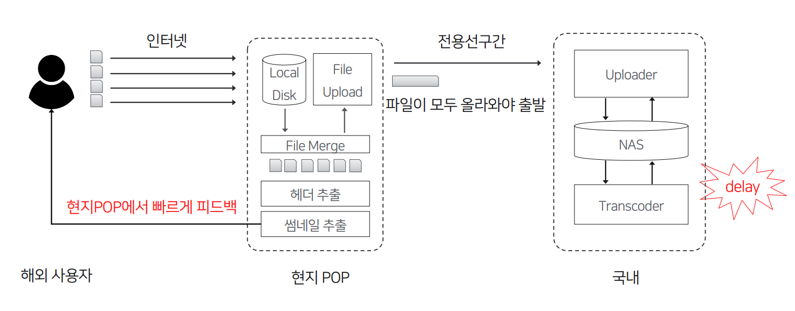

######Global 업로드 구조 개선 #2

* Transfer Queue를 통해서 Relay
* FileMerge는 국내 서버에서만 처리
* 전송 지연이 거의 발생하지 않음 

###### Global 업로드 모델의 한계

* 동영상의 대용량화는 가속
* 전용회선 B/W의 제약, 글로벌 POP의 확장 지원
* 트랜스코딩 클러스터, 오브젝트 스토리지, 분산 DB 구축

###### Ingest 단계의 작업들을 관리하자

* 10단계 이상의 Task가 존재, 계속 늘어나는 구조
* Task에 대한 제어, 실패시 자동 복구가 필요

###### 기존 구조의 문제점

* 단계가 연결된 시스템 구조
* 단위 작업 실패시 복구가 어려움

###### Orchestrator를 만들고 위임한다.

* Task간 Dependency제거
* 이제 모든 단계의 Feed Back이 가능해졌다

###### 작업 제어와 모니터링을 좀 더 편리하게

* 작업별로 리소스 사용량이 다름

* Task 요청 증가, 지연시 Consumer조정

  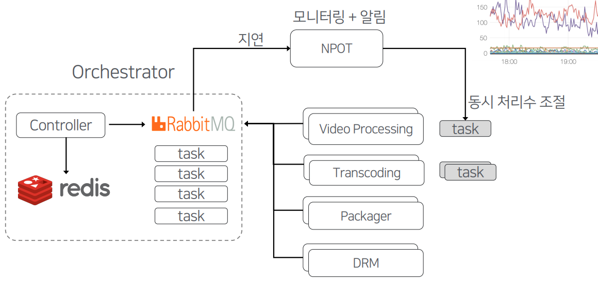

###### 기존 트랜스코딩 클러스터 상황은?

* encodeitem을 DB에서 관리, preset을 미리 만들어서 주입하는 방식
* 서비스별 인코딩 설정이 다르면 별도 클러스터로 만들어야 되는 문제

###### 로드밸런싱 문제

* 서비스별로, 시간별로 요청량이 다름
* 트래픽 증가시 수동으로 팜을 늘려줘야 하는 구조

###### 트랜스코더 클러스터 구조 개선

* 자체 트랜스코더로 내재화, Preset를 Run-time에 주입

* Orchestrator에서 Task할당, DB 의존성 제거

* 서비스별 분리된 Cluster를 통합 운영

  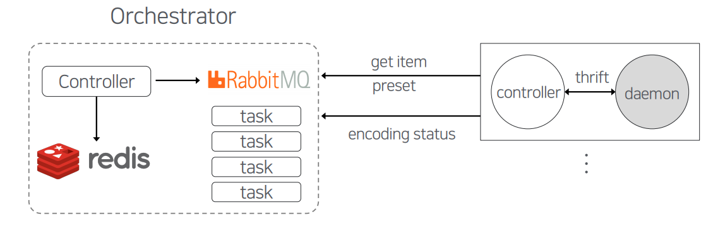

###### 새로운 트랜스코딩 시스템의 요구사항

* 저녁에 6시간짜리 FullClip이 올라오면 새벽이나 되야 노출
* 단일 시스템의 속도 제약 해소
* 대용량 시스템의 배포, 운영, Scale-out
* 스마트한 리소스 밸런싱?

###### 분산 트랜스코딩의 컨셉

* 원본 영상을 여러 조각으로 분할

* 다수의 장비에서 트랜스코딩

* 하나의 영상으로 병합

  

###### 분산 시스템의 리소스 제어?

* 오픈 소스 기반, 컨테이너 기반의 쉬운 운영
* 각 특징
  * Docker Swarm, k8s
    * host 환경의 사용이 간편
    * resource scheduling
    * network support
  * Apache Mesos
    * Distributed Kernel
    * Application에 적합한 Framework 사용
  * Hadoop YARN
    * Hadoop echo system에 최적화
* 사내 플랫폼 DockerSwarm 선택

###### 개발 초기 단계 프로토타입

* Containerized-> Controller,Distributor,Worker

* Resource Manager -> DockerSwarm

  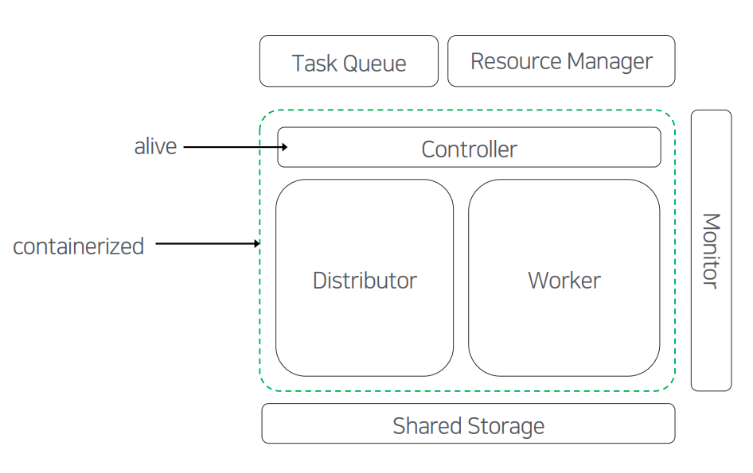

###### 분산 트랜스코딩 시스템 전체 구조

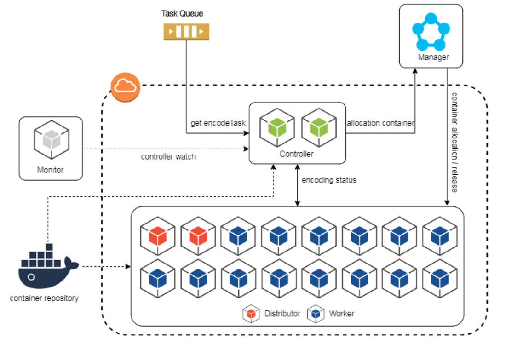

###### 대량 컨테이너 Deploy시 지연 문제

* 분산 효과를 위해서는 많은 worker가 필요
* 200개 worker동시 배치에 최대 20 ~ 30초 정도
* 20개 단위시 약 30ms 소요, 순차적인 deployscaleout

###### 네트워크 속도 저하 문제

* Worker들 간의 동영상 전송시 OverlayNetwork의 병목
* Host Network 를 사용하도록 변경, 포트 관리가 문제..
* 컨테이너간 충돌 방지를 위해 Group 단위로 포트 분배

###### 분산 트랜스코더 적용은?

* 대량 ContainerScheduling문제
* 영상별 분산 인코더 효과가 적은 경우
  * duration > 5min

###### 적용 이후 효과는?

* 배포 시간의 단축 2시간 -> 30분내 완료

* 5시간 이상 짜리 동영상이 3분내 처리

* 720P 해상도는 기존 대비 42배 이상 빠름

  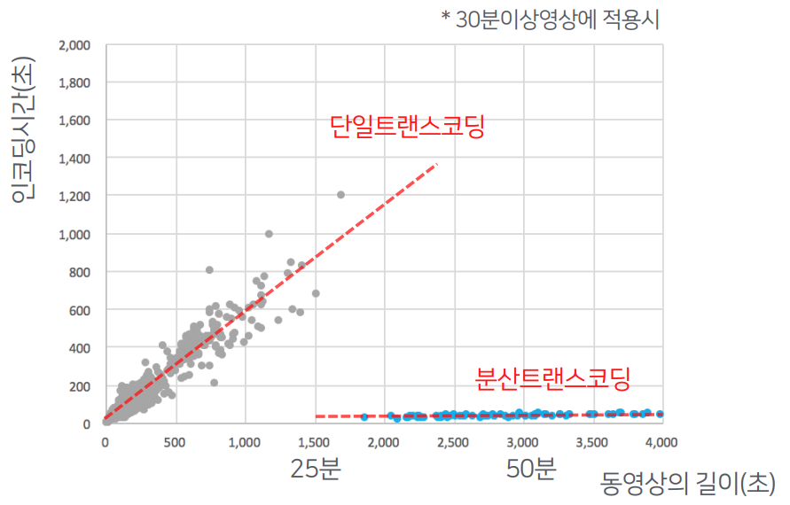

### 3. 안정적인 스트리밍 서비스 개발하기 

###### 재생에 필요한 요소와 문제들

* 재생에 필요한 다양한 정보를 전송할 공통적인 규약이 없다.
* 비디오/오디오 스트림, 코덱, 해상도, 자막, 재생 시간, 광고, 360VR,Loudness…

###### VOD재생 플랫폼의 변화

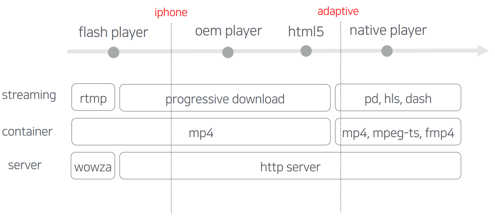

###### 왜, HLS를 많이 사용하나?

* 벤더별 StreamingProtocol 파편화
* AppleDevice의 지속적인 인기
* HLS를 지원하는 벤더가 늘어남

###### 그럼, 모든 환경에서 가능한가?

* Android는 3.0부터 Protocolversion2지원
* Chrome,Firefox,EdgeandIEnot(properly)supportingtheMPEG-TS

###### 이를 해결하기 위한 방법들

* Android’sMediaCodec 구현 (ExoPlayer…)
* HTML5 +Media Source Extensions (HLS.js, DASH.js…)
* 문제는 Native, MSE 도 안되는 환경이 존재

###### 우리는 어떤 Streaming을 사용해야 할까?

* 재생 안정성,넓은 커버리지
* Codec 호환,AdaptiveStreaming
* 수익화를 위한 컨텐츠 보호 (DRM)
* 낮은 개발 및 운영 비용

###### Multi Streaming지원시 고려 사항

* 플레이어와 재생 시스템의 구조
* Protocol간의 컨테이너 호환성?
* Dynamic, StaticPackaging?
* 스토리지 용량, Legacy 영상들의 마이그레이션?

###### Streaming 방식과 메타 정보

* 미디어 스트림 + 매니페스트 구조
* 상호간의 구조적인 호환성은 없음
  * PD
    * 미디어 스트림 Only
    * 별도 전달 해야 함
  * HLS
    * 미디어 스트림 + 메타
    * version에 따라 다름
  * DASH
    * 미디어 스트림 + 메타
    * 기술 표준, 넓은 표현

###### Playback시스템의 구조

* API가 PD의 manifest 역할도 제공 해야 함

* 플레이어는 개별 파서를 모두 구현

  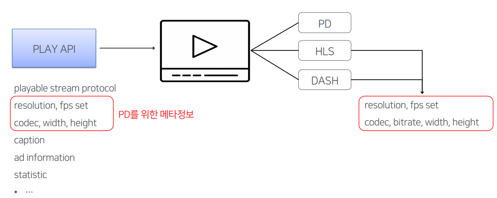

###### 재생중인 화질 표현의 문제 (HLS)

* RESOLUTION을 파싱, 세로 영상은?
* 보다 명시적인 방법이 필요하다.
  * 메니페스트의 메타 정보를 확장
  * GROUP-ID를 지정하고, NAME 으로 매핑
  * 실제 해상도가 달라도 렌더링 해상도 맞추기 용이

###### 24/7/365 재생 서비스를 보장하자

* IDC, Cloud서비스 장애, CDN 설정 실수
  * 적어도 1년에 한번
* 여러 서비스에 영향이 큰편, 스트리밍 서비스 이중화 전략이 중요

###### Single-IDC,Single-CDN 에서

* DS(Data Source)-Origin-CDN은 1:1로 매핑된 구조
* 하나라도 장애가 발생하면 video는 재생 불가

###### Multi-IDC,Multi-CDN으로

* 평상시 Locality 를 위해 같은 IDC내 전송 되도록 동작

###### 장애 시나리오에서 Fail-Over

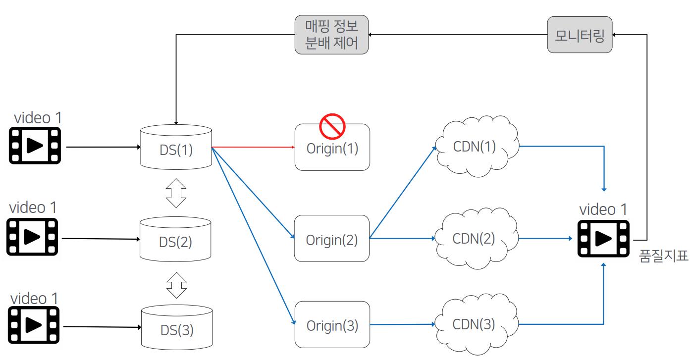

###### 재생 품질 분석 시스템

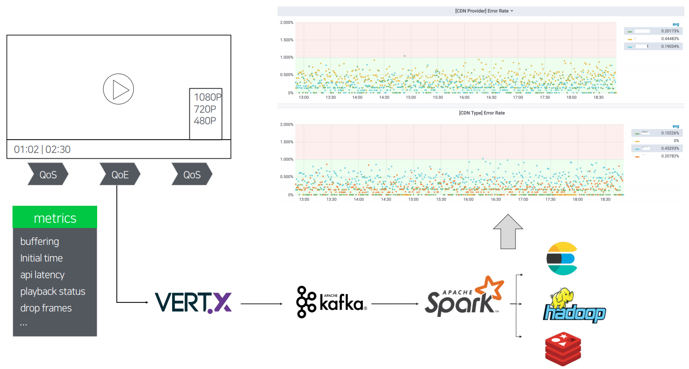

### 4. 대용량 플랫폼의 거버넌스

###### VOD플랫폼의 운영 현황?

* 네이버 전사 VOD서비스 제공
* 수십 PB의 스토리지,초당 3만건의 트래픽 처리
* 모듈수 100개, 2,000대 서버, 3개의 IDC에 분산
* SpringCloud, Struts, Python,Apache,Nginx,Hadoop,Hive,Druid,Redis, Kafka,Docker,Mysql,MongoDB,AirFlow...
* 크고 작은 장애에 대한 위험성에 노출

###### 지표 수집과 모니터링

* 시스템 별 모니터링 지표 정의를 잘해야

* 데이터 수집 및 시각화

* 안정, 장애 상황에 인사이트

* 장애 인지를 위한 알림 시스템

  * DB
    * 현재 사용량은?
    * 증설해야할 시점은?
  * Server
    * FS,CPU
    * APILatency, Thread

* 모든 정보를 통합해 보는 시스템?

  * 용도별 특화된 시스템으로 구성하는것이 낫다.

  * 재생 품질, 컨텐츠 소비

  * 실시간 오류 감지 -> 대응 장애 원인 파악

    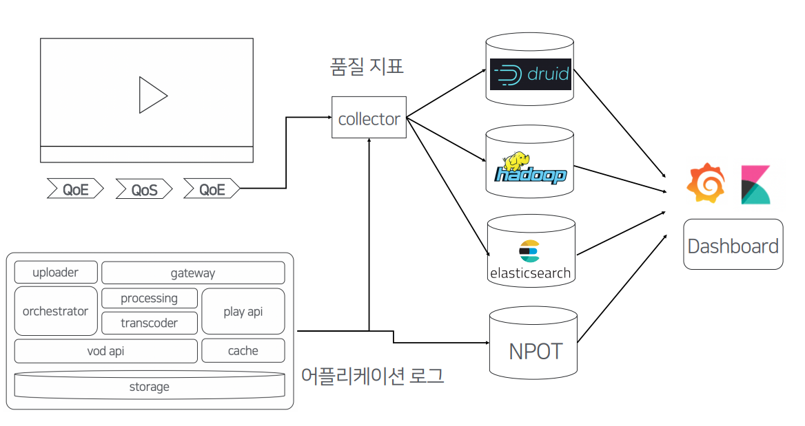

    

###### 시스템 가용량 점검 하기

* 주기적으로 구간별 아키텍처를 갱신 (2회/1년)

* 미리 구간별 병목 지점 예측

  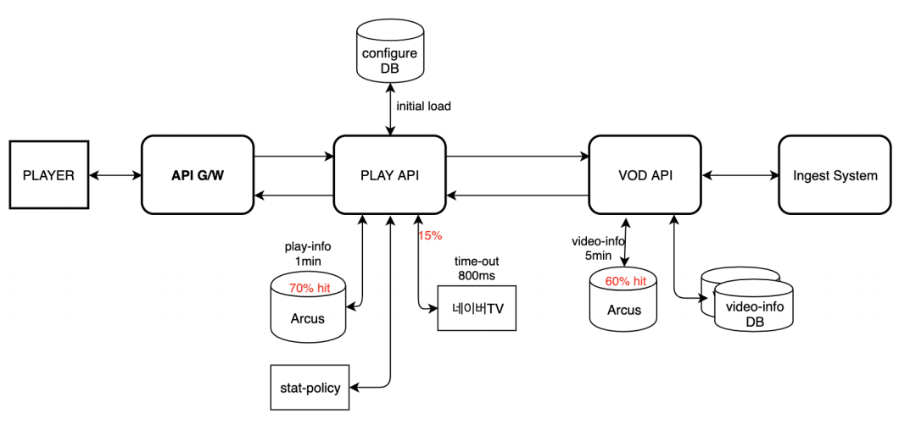

* 모듈별, 구간별 성능 테스트

* 가용량 측정표 작성

* 튜닝, 증설 계획 수립

  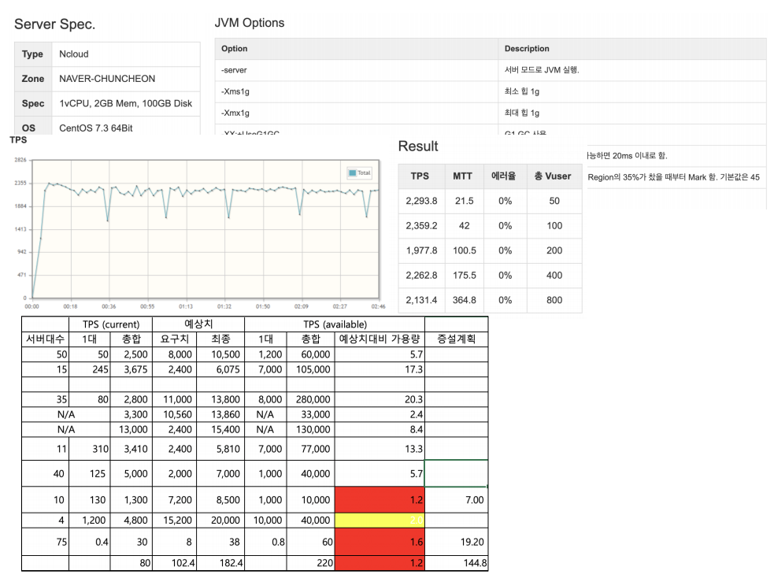

###### 장애 관리 프로세스

* 장애 리포트
* 타임 라인 (복구 시간)
* 원인 찾기
* 결과 리뷰

###### 그외 또 다른것들이 있다면…

1. 플랫폼의 개발 원칙이 있어야 하고
   * 플랫폼을 개발/운영하는것은 크고 작은 결정의 연속
   * 고가용성, 재사용성을 위한 설계, 클라이언트 설정 방지 원칙
2. 자동화에 대한 지속적인 노력이 필요
   * 시스템,서비스가 늘어날수록 자체가 Overhead로 작용
   * 플랫폼 개발 연동 가이드, CI/CD, 모니터링 운영 자동화

### What’sNext?

###### 딥러닝 기반 트랜스코딩

* 늘어나는 트래픽으로 인해 인코딩 효율화가 중요
* 딥러닝 기반, 장면 복잡도에 따른 인코딩 최적화 기술

###### Immersive 동영상 경험

* 8K/60fps트랜스 코딩 기술,VR서비스 커버리지
* DOLBY VISION / ATMOS / HDR+

###### 동영상 메타 DB서비스

* 동영상의 다양한 메타 정보를 수집, 분석할 수 있는 플랫폼
* 등장 인물, 하일라이트 구간, 주요 장면 서비스 제공

## Review

PPT도 좋고 설명도 좋았지만 VOD 시스템에 대해 잘 몰라 흡수하기 힘들다ㅠ

대용량 처리 중 가장 대표적인 VOD 플랫폼이라 흥미로웠다.

잘은 모르겠지만 일반적인 서버에서 고려해야 하는 내용과 비슷한듯 하면서 다른 부분이 많아 재밌었다!

