# 눈발자국

## About

> Tracing은 프로그램의 실행을 계측하고 검토하는 과정을 통해 프로그램 분석, 버그 찾기, 최적화와 같은 목적을 달성하는 과정을 일컫습니다. 실질적으로 Tracing이란 용어를 사용하시지 않더라도 Print류 함수 호출로 메시지를 출력하거나, Logging을 하고 그를 검토하는 과정을 한번 씩은 해보셨텐데 이런 과정을 Tracing이라 생각하시면 됩니다. 용어의 낯섬에 비해 일반적으로 많이 행하는 과정입니다.
> 
> 이번 강연은, Tracing에 대한 전문적인 세션은 아닙니다. 단지, 제가 Android의 가상머신이나 Gcc 같은 오픈소스를 분석하는 과정에서 겪은 시행착오와 그에서 얻은 경험적 결론을 공유하고자 합니다.

발표자: 박한범 / KossLab / 오픈프론티어

## Content

### 1. Tracing 소개, Printf is nothing or everything. 

#### Printf is nothing, or everything

* 개발자가 Printf를 활용하는 방식 = Tracing
* Tracing, “프로그램의 실행 동안의 변화를 다각도로 기록하고 이를 검토하는 일”
* 기록을 위한 장치 = 계측기 = Printf = instrument

#### Printf 보다 고도화 된 Instrument의 필요성

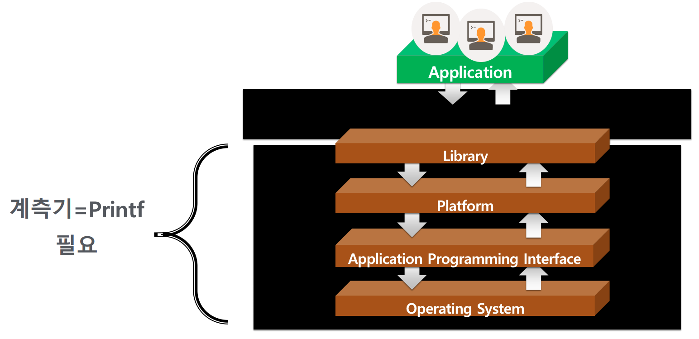

#### Printf, Printf, Printf, Printf 를 가능케 하라

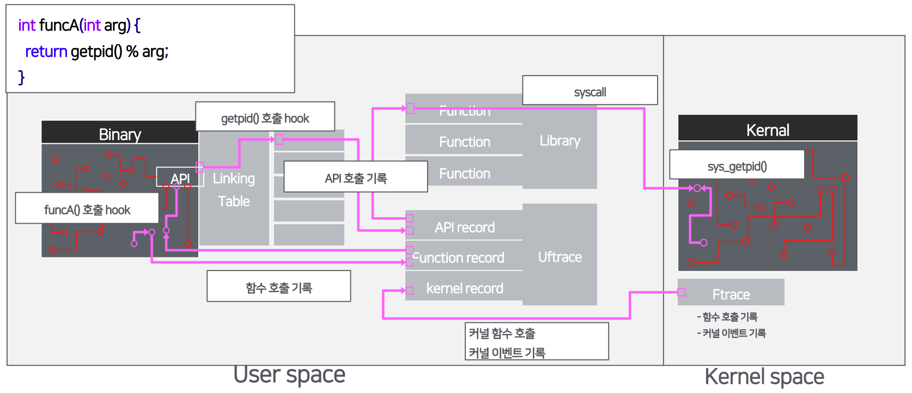

#### Printf 안되면 되게 하라!

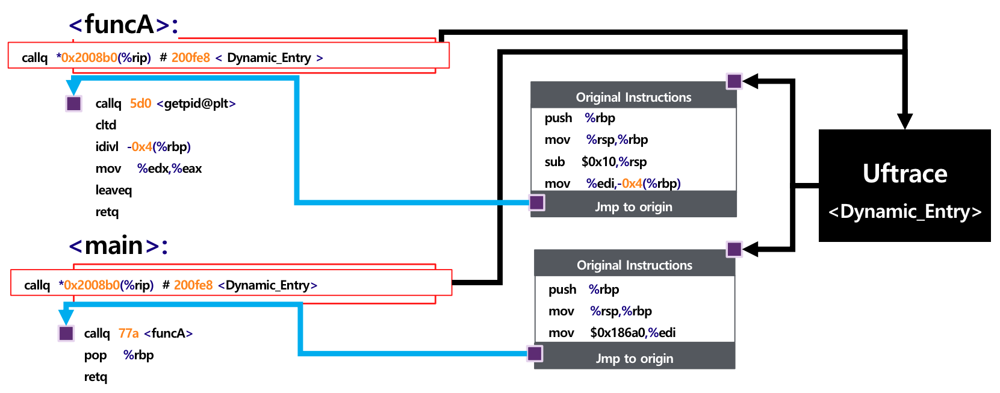

#### 모든 영역에서 Printf-ing 하다

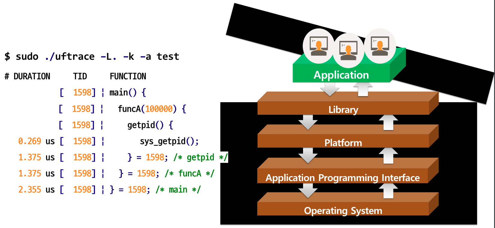

#### 기록했으니 검토를 시작해야죠…

##### Tracing, “프로그램의 실행 동안의 변화를 다각도로 기록하고 이를 검토하는 일” 에서..

1. 다각도로 기록
   * 함수 호출
   * API 호출
   * 커널 함수 호출
   * 함수 호출 인자
   * 함수 반환 인자
2. 이를 검토
   * 호출 기록 검토
   * 시각화

### 2. Tracing 에 도움이 되는 요소들 

#### Gcc에서 만난 문제를 추적했던 경우

1. 개발자가 남긴 #1 Warning Message를 따라감
2. Warning Message 로 찾은 문제지점
3. 개발자가 남긴 #2 Debug 용 로그
4. 개발자가 남긴 메시지의 중요성

#### Tracing 에 도움이 되는 요소들

###### 거대 오픈소스를 분석할 때는 관련 배경지식이 매우 중요합니다.

### 3. Tracing 오픈소스 접근성을 올려주는 요소 

#### 개발자가 남긴 메시지는 매우 중요!!

* 코드로만 보게 된다면 접근성이 매우 떨어진다.
* 부족한 배경지식은 강제로 배우게 된다.
* 물론 누군가 알려줬다면 훨씬 쉽게 가능하다.

### 4. Tracing 에 배경지식과 개발자 메시지 입히기 

#### Calling Convention – 인자 값 전달 방식

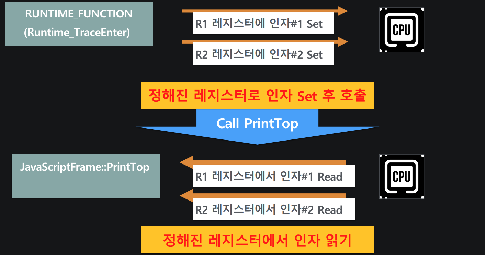

#### Uftrace에서 활용하는 방식

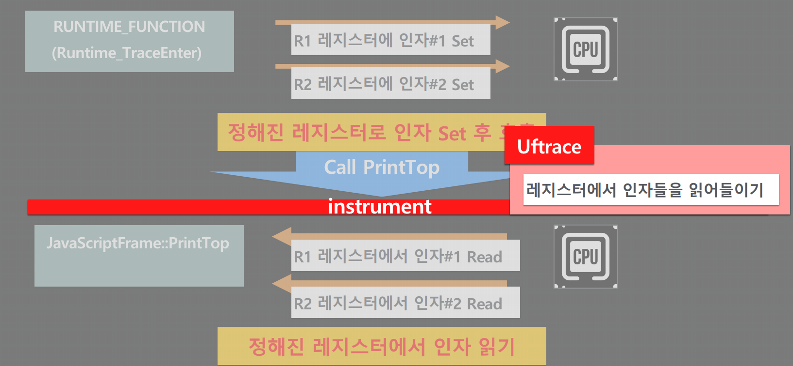

#### Uftrace로 출력 Stream 가로채기

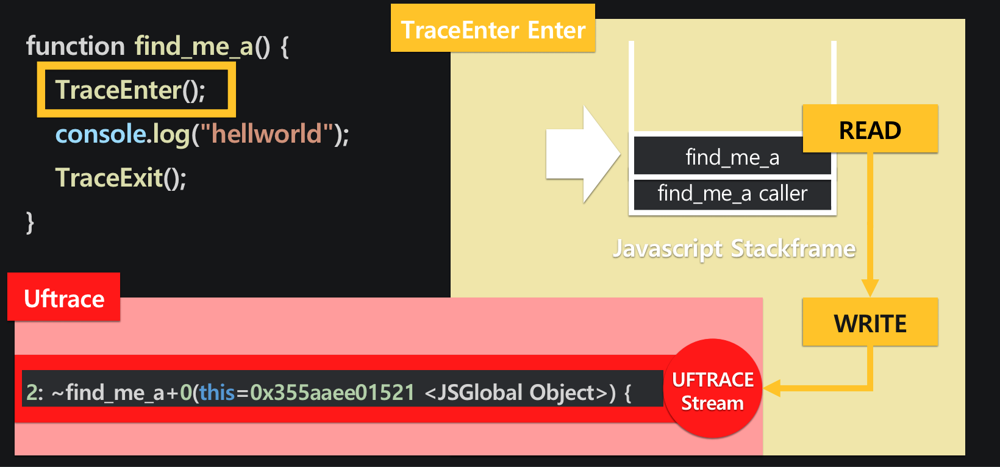

#### Pinpoint APM

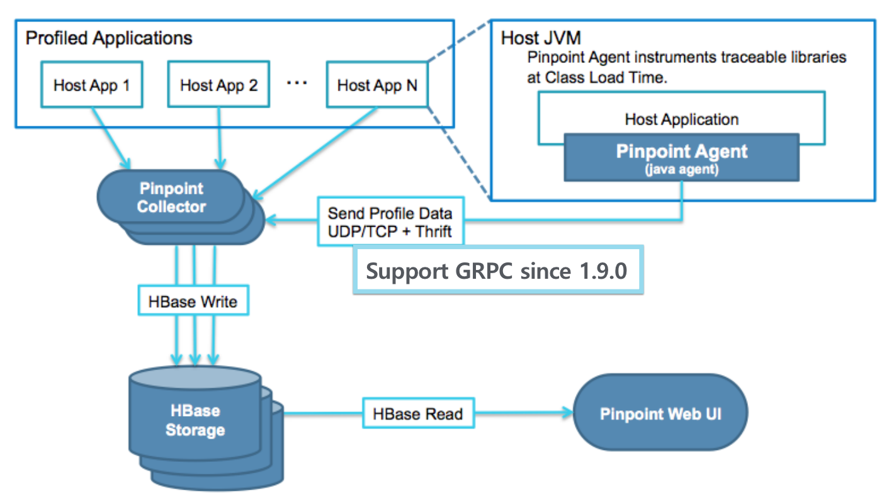

#### Simple NodeJS APM

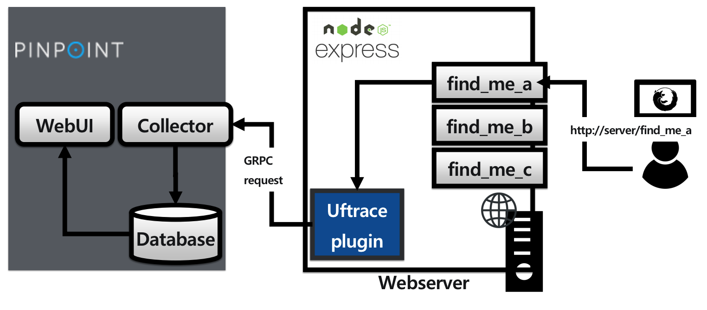

#### Javascript 코드의 실행 과정

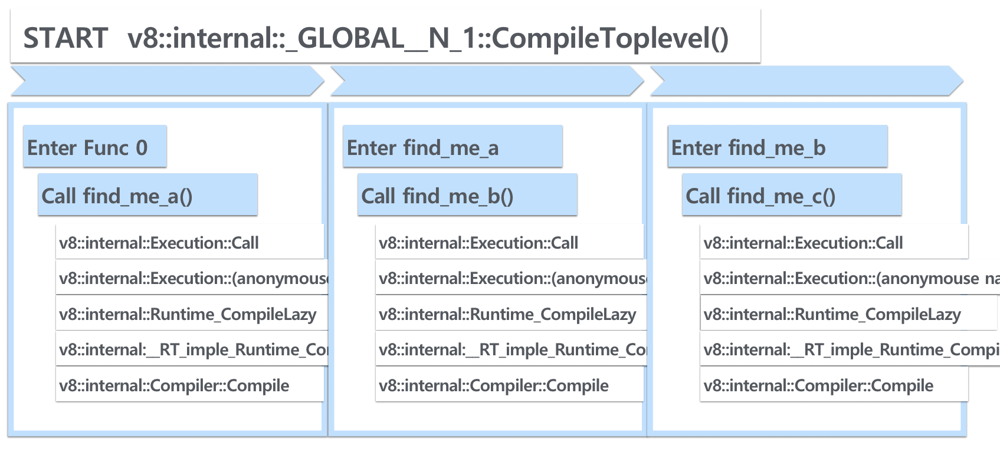

#### TraceEnter 삽입 지점

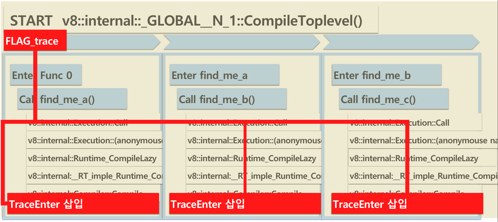

#### NodeJS에 대한 배경지식

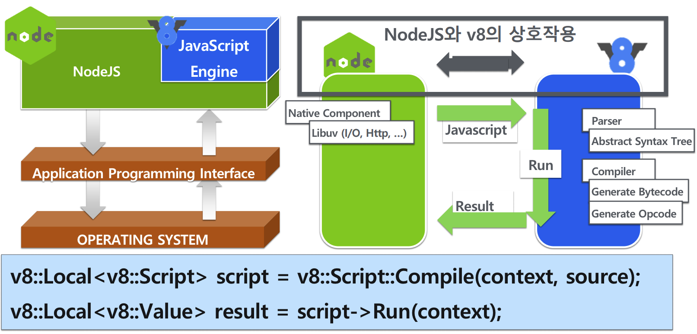

#### 배경지식 입히기

* 특정 JavaScript Function만 기록되게 만드는 로직

  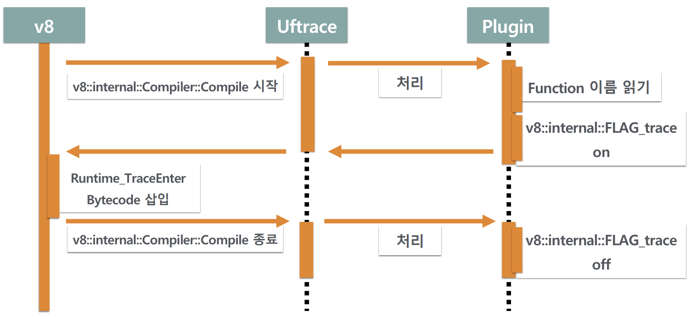

### 5. 눈발자국

#### Plugin 제작을 통한 소기 목적 달성

* Javascript 함수를 컴파일하는 CallTree -> Javascript 함수가 컴파일된다는 문맥

#### 오픈소스 접근성 높히기

* 오픈소스에 문맥 정보를 부여
  * 디버깅메시지
  * 추가정보
  * 배경지식

## Review

처음 `개발자가 Printf 를 활용하는 방식 = Tracing`이라는 단어를 보고 이번 세션은 그나마 알아들을 수 있겠군! 이라고 생각했다.

하지만 시작한지 10분도 안돼서 멘탈이 나갔다 ㅎㅎ..

C 코드와 커널에 대한 얘기가 나오자마자 머리가 하얗게 변하면서 머리에 정보가 안들어왔던 것 같다.

지금 정리하면서 보다보니 C 코드와 커널은 중요하지 않은데 멘탈이 나갔었나보다.

확실히 정리를 하니 다시 한번 복습하면서 개념을 익힐 수 있어서 좋은 것 같다!