# 모바일 시대, 웹브라우저는 더 새로운 웹 경험을 만들 수 있을까? (Whale 2.0 + Live coding)

## About

> 매년 DEVIEW를 통해 브라우저라는 IT 제품의 관점에서 기술과 개발을 이야기하는 세션입니다.
> 본 세션에서 새로운 Whale desktop 2.0을 공개하고, 이와 함께 새로와진 네이버를 함께 선보일 예정입니다.
> 
> NAVER Whale의 출시에서 지금까지 Web의 변화를 위해서 시도한 것과 웨일에 녹아있는 도전들을 공유하며, 
> 웨일에 구현된 새로운 브라우저 활용 방법에 대해 쉬운 Live coding으로 시연합니다.
> 
> 이를 통해 새로운 웹환경에서 더 사용자에게 최적화된 web service를 만들수 있도록 가이드합니다. 
> 끝으로 Web을 전진시키기 위한 플랫폼을 향한 경험도 함께 나누겠습니다.

발표자: 김효, 김지한 / NAVER / Whale

## Content

### 옴니테스킹?

#### 1. Back to the beginning

##### 웨일 소개

- 2016년 12월 베타테스트 시작

- 2017년 3월 오픈 베타 시작

- 2017년 10월 웨일 1.0 출시

- 2018년 4월 웨일 브라우저 출시

- 브라우저 점유율 5.58% (진짠가..?)

  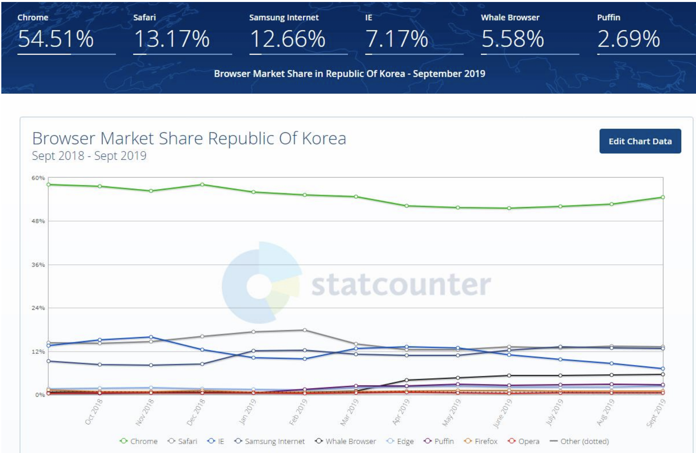

##### 웨일 특징

* 웨일 스페이스
* 퀵서치
* 스마트 팝업
* 사이드바
* 웨일 벨리

##### Web Browser? Omni-Tasking?

- 25년간의 웹브라우저는 많은 발전이 없었다.
- 25년간의 모바일은 엄청난 발전이 있었다.
  - 예를 들어 5G
- PWA (Progressive Web App) 웹과 앱을 통합
  - 구글이 몇년 째 강조하고 있지만 잘 안되고 있다.
  - Mobile First?
    - 허물어지는 모바일과 데스크탑의 경계
    - 예전엔 데스크탑을 먼저 고려했다면 요즘은 모바일을 먼저 고려한다.

#### Whale Desktop 2.0

##### Whale makes You Free

- 웨일의 핵심 개념
- 사용자의 움직임과 시간을 최적화 할 것
- 모바일 서비스 만으로도 충분하게

##### Whale 1.0과 2.0 차이 비교

* 디자인, UI/UX, ... 차이가 있음

##### 2.0 Design Concept

- 사용성을 더 쉽게, 룩은 더 고품질로, 개인의 취향까지 고려
- 퀵서치 >> 그린닷
- 접속한 웹과 상관 없이 언제든
  - 바로 검색하고 필요한 정보에 접근
  - 모바일과 빠르게 연결

##### Desktop 2.0의 새로운 웹

###### 인스턴트 사이드 패널

* 인스턴트 사이드 패널이란?

  * 웹 브라우징 사용 흐름 중 특정 과업을 사이드 패널에서 이어갈 수 있도록 하는 기능입니다.

    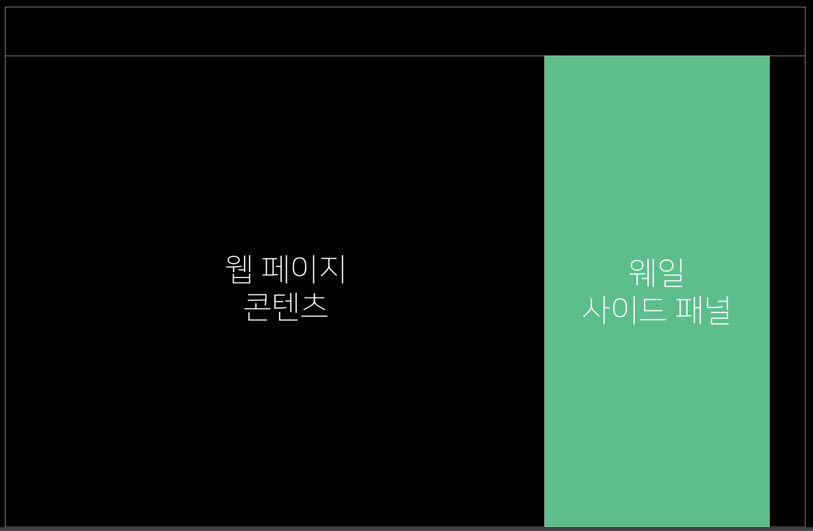

* 사용 시나리오 시연  - 네이버 쇼핑하기 (IE 11 vs 네이버 웨일)

  * 장점

    * 깔끔한 팝업

      * 그동안 팝업으로 밖에 띄울 수 없었던 모바일 페이지, 콘텐츠를 사이드 패널에 넣어 팝업 차단 걱정 없이 더욱 깔끔한 UI로 한 화면에서 제공할 수 있습니다.

        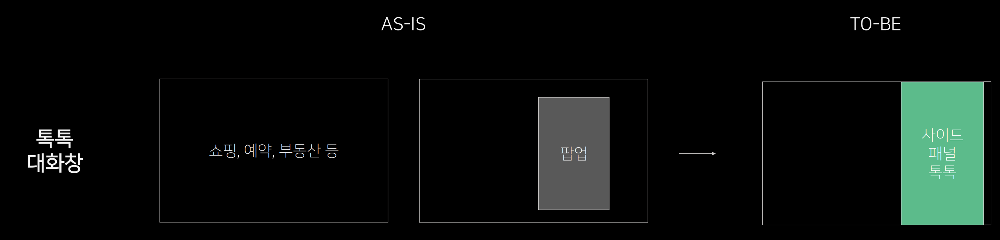

    * 보조 컨텐츠

      * 메인 콘텐츠를 보조하여 설명하거나 연결할 링크가 있을 때 새 탭으로 보내지 않고 바로 사이드 패널에서 동시에 보여 줄 수 있어, 웹서핑의 흐름이 이어지고 시간을 단축

        

    * 모바일 서비스 적용

      * 아직 PC에는 적용 전이거나 모바일 전용 서비스/기능도 모바일 웹 페이지 그대로 사이드 패널에 넣어 PC 서비스에 쉽게 사용하도록 할 수 있습니다.

        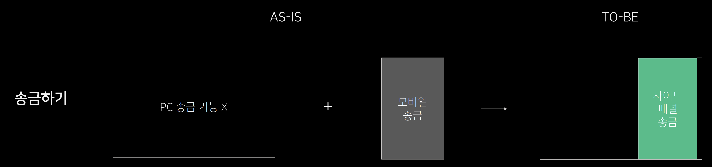

  * 고민

    * Single instance vs Multi instance
      * 선택은 Multi instance
      * 한번에 닫는 버튼 제공
    * Life cycle은 언제 닫히는가?
      * 위에서 Multi instance 제공으로 닫는 버튼을 제공

* 사이드바 확장

  * 확장앱(Extension)이란?
    - 웹 브라우저에 새로운 기능을 추가하여 동작하게 하는 웹 브라우저용 프로그램입니다.
    - 특히 웨일에는 사이드 패널을 사용하는 사이드 바 확장앱이 있습니다.
    - 가장 쉬운 Omni-tasking
      - 사이드 패널을 자유롭게 이용
      - 사이드 패널이 가지는 Omni-tasking의 장점을 활용
      - 모바일 서비스의 쉬운 PC 이식
      - 현재 80여개의 사이드바 확장앱이 웨일 스토어에 등록
      - 웨일 사이드바 확장앱을 통해 모바일이 익숙한 사용자를 Lock-in 해보세요.

* 더 편한 PWA : 웹앱

  - 웹앱이란?
    - 인스톨 없이 웹에서 바로 실행하거나, 인스톨 후 바탕화면에서 독립 실행할 수 있는 PWA(Progressive Web App)를 말합니다.
      - Stand-alone
      - Web Update
      - Frame Color
      - Off-line

* Desktop PWA는 왜 어려운가?

  - 해결방법
    - 설치 없이 링크로 실행
    - 웹앱 전용 URL 가능
    - 기본 컨트롤러 제공
    - 다양한 기본 창 기능 (투명도, always on top)

#### 3. 쉽게 적용해서 더욱 가벼운 웹서비스를 만들어 보자 (Live coding)

###### 인스턴트 사이드 패널

###### 사이드바 확장

###### 더 편한 PWA 웹앱

###### 라이브 코딩

- href 에서 rel="whale-sidebar"만 추가하면 된다.
- window.open 에서 "whale-sidebar"만 추가하면 된다.
- extensions 추가도 완전 쉽다!
- 10분만에 위 3개 전부 라이브 코딩 하셨음. (쩐다..!)

#### 4. "Move the Web Forward"를 위한 속사정

###### 오픈소스의 무게 : Rebase

- 제품 품질을 올리는 가장 효과적인 방법 : 빠른 Code Rebase

- 2018 

  - 데스크탑 2회 rebase (반기에 1회) 
  - 크로미움 version 주기 : 6주 
  - Rebase는 크로미움 기반 브라우저 벤더의 가장 어려운 숙제

- 2019

  - 분기 당 1회 rebase 버전 release (년4회)
  - Rebase 전담 TF 구성 및 전문 기술화
  - 데스크탑/안드로이드(네이버앱 포함) rebase 기술 공통화

- Whale의 Chromium Rebase 방식

  - Phase 1: 초도 버전 리베이스 (by rebase 장인) 

  - Phase 2: 각 모듈 담당자 리베이스

  - Phase 3: QA/안정화

    - 리베이스 기간중 기능 개발, 모바일 리베이스등의 업무도 병행
    - 테스트, 성능, 메모리등 관련 설비 개발은 미산정

  - 3번의 Rebase

    - 웨일 70 Vs 웨일 73 Vs 웨일 76

      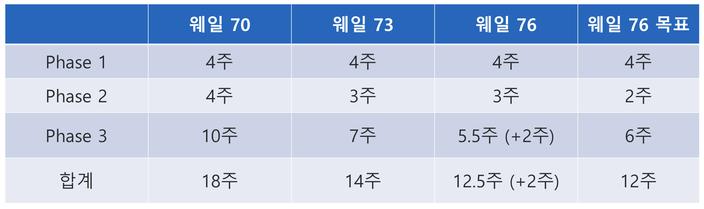

      

    - Rebase 76 회고
      - 최대한 최신 version의 release를 위하여 dev branch를 target으로 했더니, beta/stable을 올리면서 새로운 rebase 수준의 고통이 있었다 
      - 76 rebase를 하면서 73의 의미 있는 기능을 개발하고, release 하는 것이 너무 큰 overhead 
      - 76 rebase 기획/디자인이 확정되지 않은 상황에서 rebase와 개발을 병행하기 어려움
      - 앞으로는?
        - rebase 대상은 beta branch로 
        - Phase 2가 시작되면 더 이상 이전 version의 release는 없다.
        - 기획/디자인은 미리 챙기고, rebase 주기에 맞춘다
    - Rebase의 목표 : Rebase 회고 시 더 이상 할 이야기가 없게 만든다.
    - Rebase 이외에도 여러 환경적인 변화도 인지해야 한다 (compiler 등)

- 최종 목표는 궁극의 Rebase를 위한 통합 엔진

  - 한번 rebase로 모든 target에 적용되도록!!!

###### 클린웹 (aka 광고차단)

- 광고 차단계는 크게 2개로 나뉜다.

  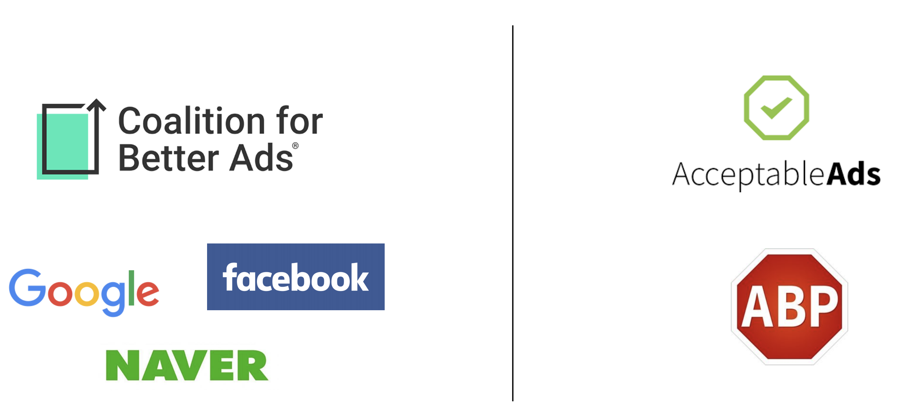

- 그 중 우리는 CBA 표준(왼쪽) 을 지킨다.

  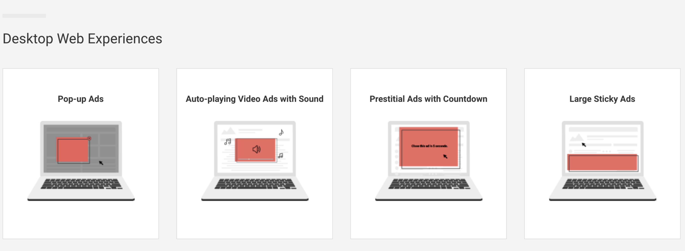

  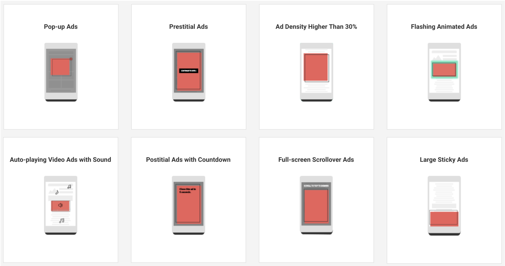

* 광고차단 Overview

  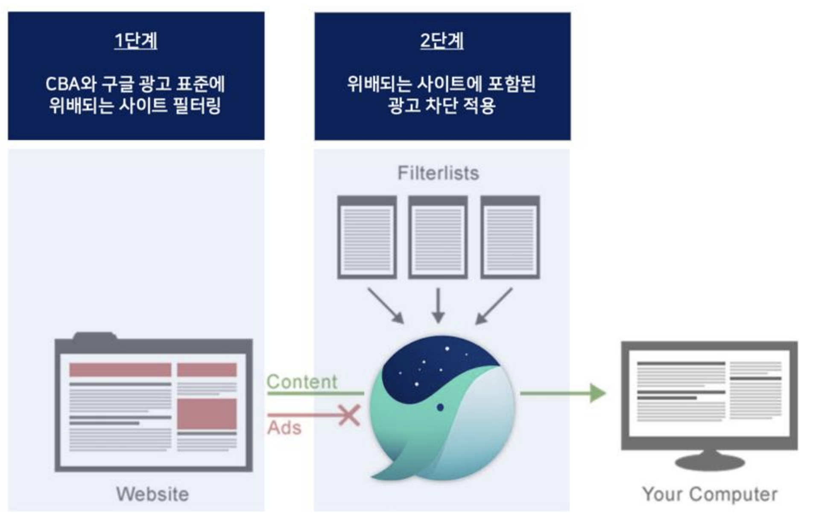

  * 1차 필터

    * Naver + CBA + Google

    * A part of SafeBrowsing DB

      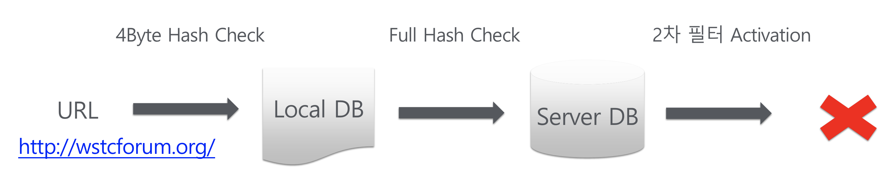

  * 2차 필터

    * Subresource Filter

      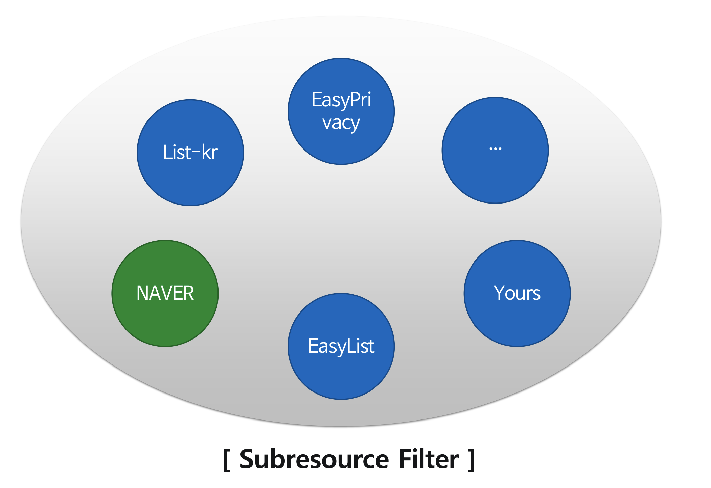

    * Rule Generation

      - Compaction

        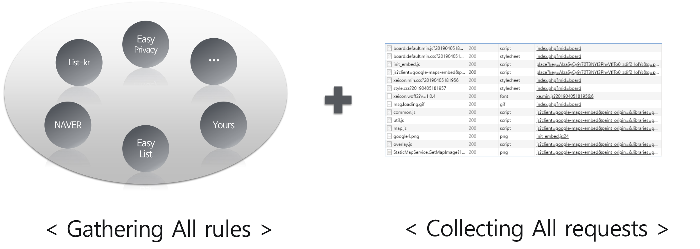

      - Convert

        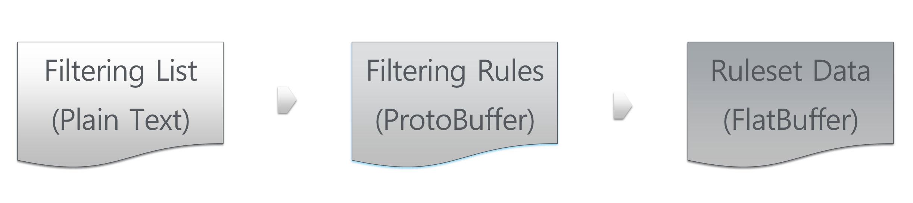

    * How to works?

      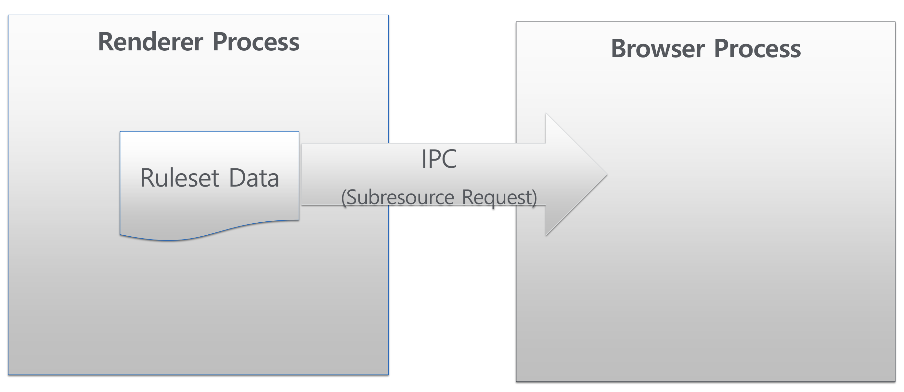

    * 광고 차단 Method

      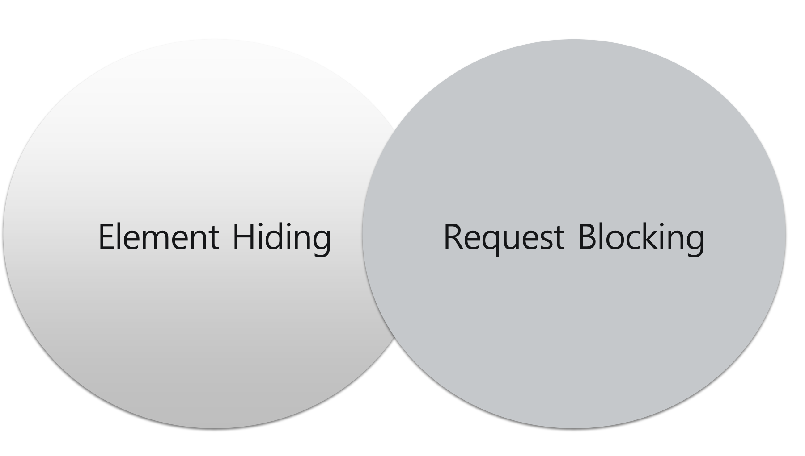

* 건강한 광고 생태계를 만들기

* 더 해야 할 것들

  - Element hiding & re-layout
  - 광고 차단으로 인한 콘텐츠 차단 문제
  - 차단되지 않는 광고 처리
  - ML을 이용한 2차 필터 업데이트 및 사이트 평가

###### 프로그램 설치 없는 웹인증서 2.0

- 플러그인 설치 없는 웹환경을 위해

  - 그 중 첫 번째, 사라지지 않는 공인 인증서
    - Active X => EXE / 모바일 => EXE / 모바일 / 브라우저인증서
  - 진화하는 웹 기술과 한계
    - 웹을 이용한 전자서명 표준 : W3C Web Cryptography API
    - 인증서 관련 표준에 관한 시도, SOP 등의 이유로 논의가 중단
  - 표준화 기반 편리하고 안전한 방법에 대한 고민
    - 크롬, 사파리, 파이어 폭스등 글로벌 브라우저들의 무관심
    - 웨일 브라우저 Move the web forward의 첫번째 과제

- 웹인증서 1단계 : 빠른 적용/호환

  - Origin Trials 기반으로 등록된 사이트들에서만 API 동작

  - Windows, macOS, Linux 3개 플랫폼에서 동작

  - 웹인증서 API 1.0 

    - 웹인증서 API 1.0 예제

      ```javascript
      var message = new ArrayBuffer(1024);
      
      navigator.whaleCertificates.get({"keyUsages":["nonRepudiation"]})
      	.then(list => list[0])
      	.then(certificate => navigator.whaleCertificates.importPrivateKeyFrom(certificate, { name: "RSASSA-PKCS1-v1_5", hash: {name: "SHA-1"}}))
      	.then(keyinfo => window.crypto.subtle.sign(keyinfo.privateKey.algorithm, keyinfo.privateKey, message));
      ```

    - 웹인증서 API 1.0 sequence

      - 보안 요소 있음

        - 랜더 프로세스(샌드박스) 안으로 민감한 개인정보가 전달됨

      - 호출관계가 복잡함

        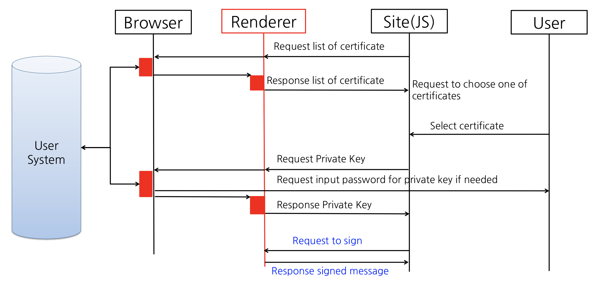

  - 웹인증서 API 2.0

    - 웹인증서 API 2.0 예제

      ```javascript
      partial interface SubtleCrypto {
      	Promise<SignedObject> certSign(BufferSource dataToSign, AlgorithmIdentifier algorithm, CertificateOptions options);
      };
      
      window.crypto.subtle.certSign(messageBuffer, { name: "RSASSA-PKCS1-v1_5", hash: { name: "SHA-256" }}, {"keyUsagses" : [ "nonRepudiation" ]})
        .then(signedObject => {
        	// Do something with signedObject here
      	}).catch(error => {
        	// Handle exceptional case here
        	console.log(error.name + ":" + error.message);
      	});
      ```

    - 웹인증서 API 2.0 sequence

      - API 간소화

      - 보안 요소 강화

        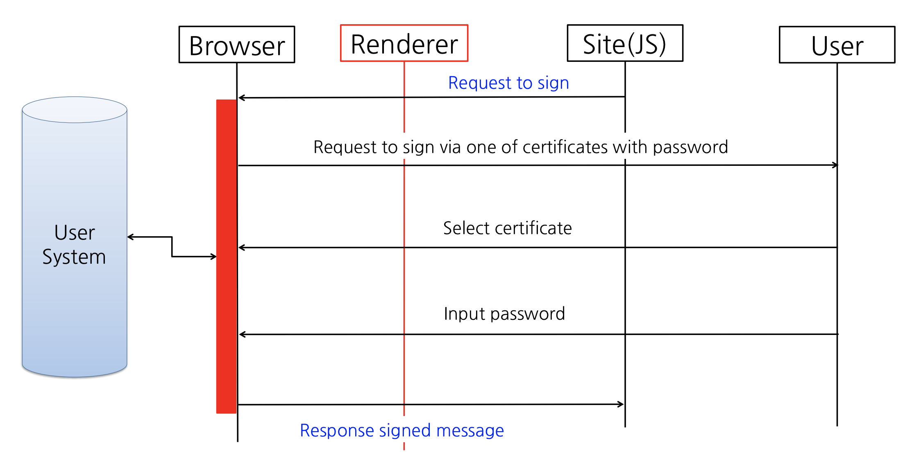

  - 웹인증서 API 표준화 제안

    - W3C TPAC 2017에서 표준화 제안	

    - Certificate based digital signature 표준화 제안

    - MS, Google, Apple 등으로 부터 긍정적인 피드백과 협력 모색

      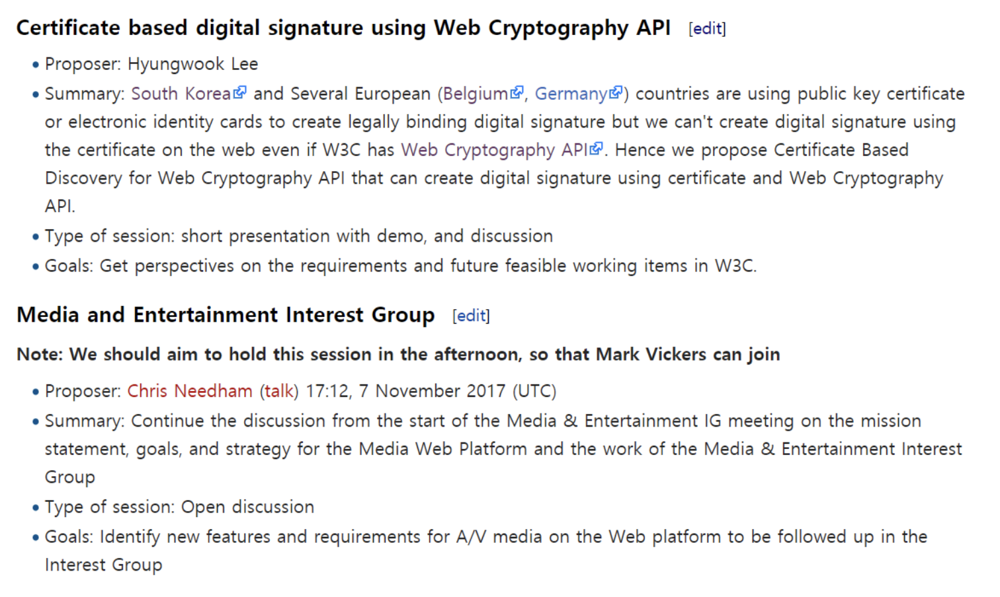

      - 2019 Web Certificate API Community Group 생성

      - 2019 TTA 국내 표준 제안 중

        


#### 5. 옴니테스킹을 위한 여정 : Whale Mobile 1.0

###### 특징

- 클린웹
- 강력한 PIP
- 다크모드
- 새탭/테마

###### 새로운 모바일 : 듀얼 스크린 브라우저

- LG V50S의 듀얼 스크린에 맞추어 듀얼 스크린용 웨일을 개발

- 2개의 화면을 통해 모바일에서도 옴니태스킹을 강화

- Mobile Omni-tasking

  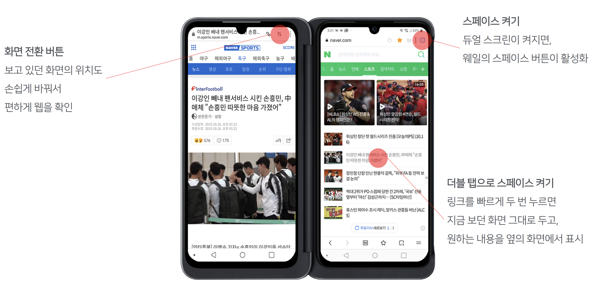

- 듀얼 스크린 UX

  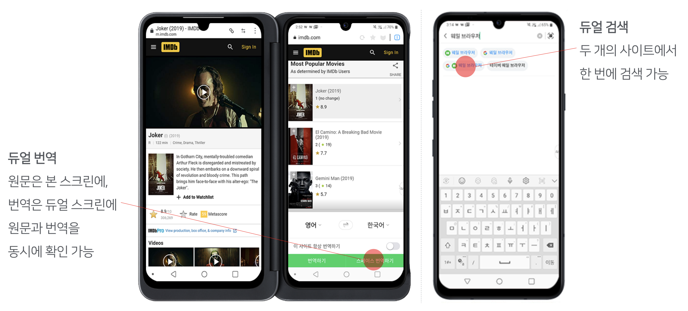


#### 마치며

###### 왜 브라우저를 만들었나요?

- MS의 업데이트 중단 
- 너무 많은 플러그인 
- 느린 브라우징 속도
- 불 친절한 사용성
- Google 의존도 증가
- 점점 무거워지는 제품

###### 우리는 익숙함이라는 이유로 매일 똑같은 불편함을 겪고있습니다.

###### 기존의 웹 환경에서 벗어나 사용자를 자유롭게 하자!

###### Whale makes you free

- 빠른 속도와 새로운 기능을 바탕으로 사용자 경험의 극대화 이를 통해 개인의 웹, 인터넷 활동의 자유도를 증가
- 오래되고 낡은 웹 사용 환경과 위험으로부터의 탈피, 자유로운 웹 환경을 제공

###### 웨일 연구소

- 연구원 22,100명
- 연구 의견 47,400건
- 많은 성장을 하고 있으니 다들 도와주세요!


## Review

웨일이 생각보다 점유율이 높아서 놀랐고 생각보다 훨씬 잘 만든 것 같다.

아직 한번도 안써봤는데 한번 사용 해봐야겠다.
