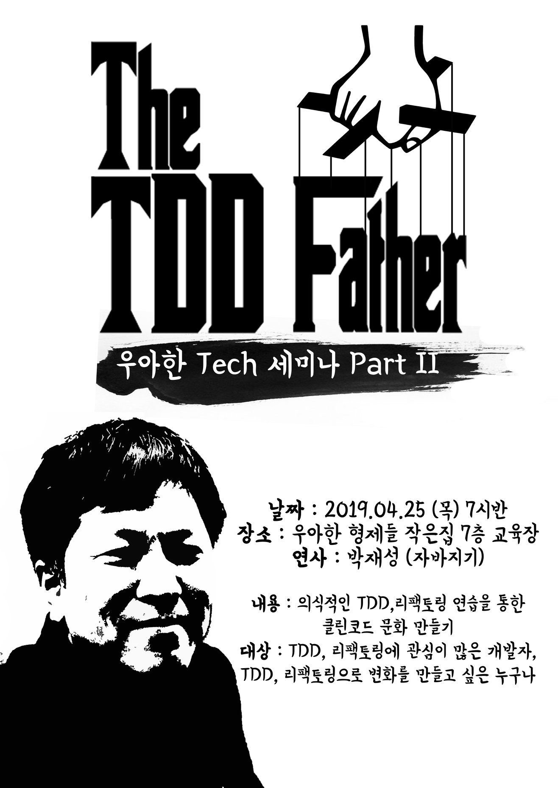

# 의식적인 TDD, 리팩토링

* 주최: [우아한형제들](https://www.woowahan.com/)
* 일시: 2019/04/23 19:30 ~ 21:00
* 장소: 우아한형제들 작은집, 서울 특별시 송파구 올림픽로 295 7층 교육장
* 연사: 박재성(자바지기)
* 대상: TDD, 리팩토링에 관심이 많은 개발자, TDD, 리팩토링으로 변화를 만들고 싶은 누구나

## About

## Content

### 다과 및 음료

> 음료수와 빵

### 소개

1. 연사 소개
   - 반란군을 키우는 포비
   - 입사한지 4개월 밖에 안되심
   - 그래서 이 발표는 배민의 노하우가 아닌 순전히 박재성님의 생각임
   - 배민에서 우아한 테크 코스 설계 담당
   - 넥스스스텝(NextStep) 교육
   - 헤드헌터
   - SLiPP 운영
   - 등등...
2. 세미나 소개
   * 이번 세미나에 50명 초대에 600명 지원
   * 많은 사람들에게 지식 전파를 위해 같은 회사인 경우 1명만 합격 (나는 퇴사했다는게 함정)
   * TDD와 리팩토링이 왜 중요한지 얘기 하지 않음 (필요성을 아는 사람 대상)
   * 개발 떠난지 6년이 넘었으니 전부 믿지 말아주세요.
   * 자칭 꼰머

### 의식적인 연습이란?

* 무조건 연습을 많이 한다고 잘할 수 있지 않다
  * 테스트하기 쉬운 코드와 테스트 하기 어려운 코드를 보는 눈
  * 테스트하기 어려운 코드를 테스트 하기 쉬운 코드로 설계하는 감
* 교육자로서 최근의 고민
  * 좀 더 효과적으로 연습할 수 있는 방법은 없을까?
    * 1만시간의 재발견 책에서 답을 찾음
      * 목적의식 있는 연습에 얼마나 많은 시간을 투자했느냐?

* 의식적인 연습의 7가지 원칙
  1. 효과적인 훈련 기법이 수립되어 있는 기술 연마
  2. 컨포트 존을 벗어난 지점에서 진행, 자신의 현재 능력을 살짝 넘어가는 작업의 자속적으로 시도
  3. 명확하고 구체적인 목표를 가지고 진행
  4. 신중하고 계획적이다, 즉, 개인이 온전히 집줃하고 의싲걱으로 행동할 것을 요구
  5. 피드백과 피드백에 따른 행동 변경을 수반
  6. 효과적인 심적 표상을 만들어내는 한편으로 심적 표상에 의존
  7. 기존에 습득한 기술의 특정 부분을 집중적으로 개선함

* 제약사항을 걸고 연습하자
  1. 함수 10라인 
  2. indent 1
  3. 함수 인자 3개
  4. else 금지

### TDD. 리팩토링 적용 - 개인

> 개인이 연습하는 방법
>
> 리팩토링은 운동과 같다, 평생동안 연습하겠다는 마음가짐으로 시작해야 한다.

#### 시작하기 - 주변 정리해 꾸준히 연습할 시간확보

* 애인과의 만남 시간 조정
* 친구들과의 관계 끊기
* TV 보지 않기, 게임하지 않기

##### 토이 프로젝트 찾기

* 주변 환경에 영향을 받지 않고 꾸준히 연습하기 위함
* 작은 것도 꾸준히 하는게 중요

##### 단위테스트 연습

* 내가 사용하는 API 사용법을 익히기 위한 학습 테스트에서 시작
* 자바 String, List API 등등

##### 연습 효과

* 단위테스트 방법을 학습할 수 있다.
* 단위테스트 도구의 사용법을 익힐 수 있다.

Input과 Output이 명확한 알고리즘이 연습하기 좋다.

#### TDD 연습

* TDD 연습이 목적
* 난이도가 낮거나 자신에게 익숙한 문제로 시작하는 것을 추천
* 웹, 모바일 UI나 DB에 의존관계를 가지지 않는 요구사항으로 연습 (어려움)
* 한번에 모든원칙을 지키면서 리팩토링하려 하지 마라
* 한번에 한가지 명확하고 구체적인 내용을 해라
* 연습은 극단적인 방법으로 연습하는게 좋다.
* 예를 들어 한 메서드 라인 제한을 15라인 -> 10라인으로 줄여가면서 연습하는 것도 좋은 방법

#### 클래스 분리

* 모든 원시값과 문자열을 포장한다.
* 일급 콜렉션을 쓴다.
* 3개 이상의 인스턴스 변수를 가진 클래스를 쓰지 않는다.

#### 토이 프로젝트 난이도 올리기

> 게임이 토이 프로젝트로 좋다.

##### 연습하기 좋은 예

* 로또
* 사다리타기
* 볼링 게임 점수판
* 체스
* 지뢰찾기

#### 의존관계 추가를 통한 난이도 높이기

* 웹, 모바일, DB 등
* 한 단계 더 나아간 연습
* 컴파일 에러를 최소화
* ATDD 기반
* 레거시 애플리케이션에 테스트 코드 추가

#### 실패하는 이유

* 연습이 충분하지 않은 상태에서 높은 난이도에 도전하기 때문

##### 구체적인 연습 목표 찾기

* 소트웍스 앤솔러지
* 객체지향 생활체조 원칙
* 클린코드

##### 필요한 것

* 조급함 대신 마음의 여유
* 토이 프로젝트
* 같은 과제를 반복적으로 구현할 수 있는 인내력, 꾸준함, 성실함

### TDD. 리팩토링 적용 - 개인(주니어) -> 팀

> 팀에 전파하는 방법

#### 생각해 볼 점

* 사람은 기본적으로 변화를 거부하는 성향
* 팀은 변화를 거부하는 성향이 더 강함
* 대부분 변화에 실패한 경험을 가지고 있음

##### 시도

* 팀에서 거부하면 내가 맡은 기능에 TDD 혼자 진행
* 그러다 관심있는 사람이 생기면 전파
* 내가 구현한 코드 또는 동료의 관심에서 작은 성공을 맛본다. (중요)

##### 팀장이 하지말라하면? 

* 하지말고 더 좋은 회사로 가자
* 연봉을 올려 이직한다.
* TDD, 리팩토링을 전파를 시도한다.
* 경력이 쌓이면서 내가 리더가 된다.

### TDD. 리팩토링 적용 - 내가 리더

> 팀장으로 팀에  문화를 전파하는 방법 ('팀에 변화 만들기' 가 더 적합)

#### 리더가 추가로 생각해야 할 점

* 1:1로 공략
* 팀원이 개선할 부분을 말하고, 해결책을 제안하도록 유도

#### 시작하기

* 팀원들과의 신뢰 형성
* 1:1 면담을 통해 개선할 부분 찾기

##### 1:1 면담에서 기억해야 할 점

* 문제점에 대한 해답을 제시하려하지 말고, '어떻게 하면 될까?', '너라면 어떻게 해야할 것 같아?' 반문을 해라
* 팀장에서 나온 의견이 아니라 팀원으로부터 나온 의견인게 중요

##### 실행

* 1:1 면담, 팀 회고를 통해 우선 순위가 높으며, 작은 변화를 통해 가장 높은 효과가 있을 것으로 생각하는 Practice를 선정
* 익숙해 질 때까지 한 가지에 집중한다.
* 변화를 완료함으로써 작은 성공 맛본다.
* 팀이 같이 작은 성공을 맛보는 것이 중요하다.

**가장 중요한건 현재보다 조금씩 나아지고 있다는 방향성이 중요하다.**

### 마치며

* 작은 성공을 쌓아 큰 성공
  * 한번에 바꾸려는 습관을 버릴 때가 됐다.
  * 작은 성공을 쌓아서 마지막에 큰 성공을 맛보자.
* 실패해도 괜찮다.
  * 실패하기 전보다 성장한다.
  * 좋은 회사는 실패해도 같이 도전하는 사람을 원한다.

**가장 필요한 것은 가보지 않은 길에 꾸준히 도전할 수 있는 용기**

### Q/A

1. 리팩토링 시 예쁘게 짜면 로직이 느려지는 경우가 발생하는데, 어떻게 생각하시는지?

> 많이 받는 질문 중 하나
>
> 과거 하드웨어의 비용 비쌌지만, 갈수록 하드웨어 비용 싸졌으며 인건비 비싸짐
>
> 일단은 가독성 위주가 좋아보이는데 그 이유는
>
> 1. 코드에서 성능 문제보단 외부 API의 문제일 확률이 높음
> 2. 진짜 코드의 문제더라도 문제가 생기면 고치면 된다.
>
> 대기업인 경우는 설계시 성능도 고려해야 한다.

## Review

작년 오키콘에서 들었던 내용과 유사했다.

그러면서 작년에도 이런 좋은 내용을 듣고 바뀐게 없다니 하는 반성을 했다.

생각해보면 항상 TDD를 실패했던 이유는, 충분한 연습이 부족했던 것 같다.

충분한 연습이 필요할 것 같다.

그리고 세미나 신청을 한 회사에서 여러 명 했으면, 한 명만 합격했다고 하셨는데 나는 퇴사를 했다...

수퍼브 개발자님들 미안합니다...
